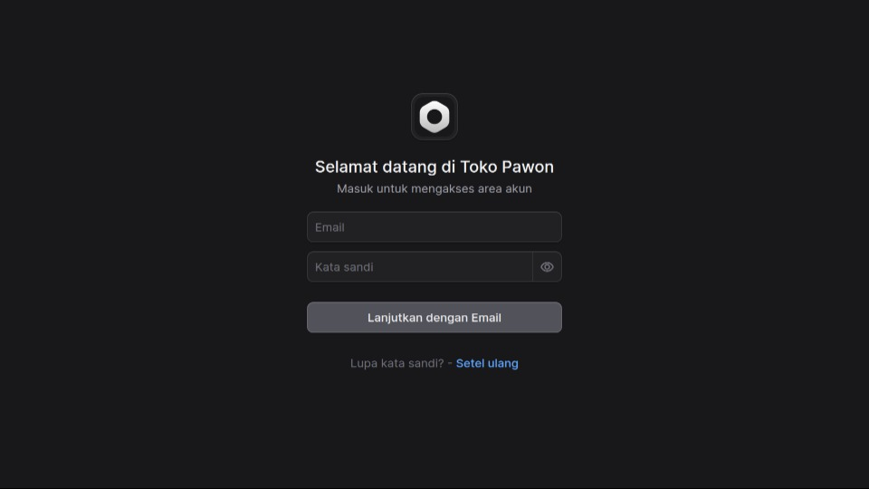

## Tata Cara  Masuk Ke Halaman Admin Toko Pawon

Buka alamat [https://store.tokopawon.id/app](https://store.tokopawon.id/app)

 

Berikut adalah panduan langkah demi langkah untuk melakukan proses masuk (login) ke akun Toko Pawon Anda berdasarkan tampilan halaman pada gambar:

### Langkah-Langkah Login

1. **Akses Halaman Login:** Pastikan Anda sudah berada di halaman utama login yang menampilkan pesan "Selamat datang di Toko Pawon" dan "Masuk untuk mengakses area akun".
2. **Masukkan Alamat Email:** Pada kolom pengisian pertama, ketikkan alamat **Email** yang sudah terdaftar pada akun Toko Pawon Anda.
3. **Masukkan Kata Sandi:** Pada kolom pengisian kedua, ketikkan **Kata sandi** rahasia Anda. 
    * > **Tips:** Anda dapat mengklik ikon bergambar "mata" di sebelah kanan kolom kata sandi untuk menampilkan atau menyembunyikan karakter sandi. Fitur ini sangat berguna untuk memastikan Anda tidak salah ketik.
4. **Tekan Tombol Masuk:** Setelah memastikan email dan kata sandi sudah terisi dengan benar, klik tombol **"Lanjutkan dengan Email"** untuk mengakses area akun Anda.

---

### Kendala Login (Lupa Kata Sandi)

Jika Anda mengalami kendala saat login karena lupa kata sandi yang digunakan, Anda bisa mengikuti langkah berikut:
* Temukan tulisan "Lupa kata sandi? - **Setel ulang**" di bagian paling bawah layar.
* Klik pada teks **"Setel ulang"** yang berwarna biru tersebut untuk dialihkan ke halaman pemulihan kata sandi akun Anda.