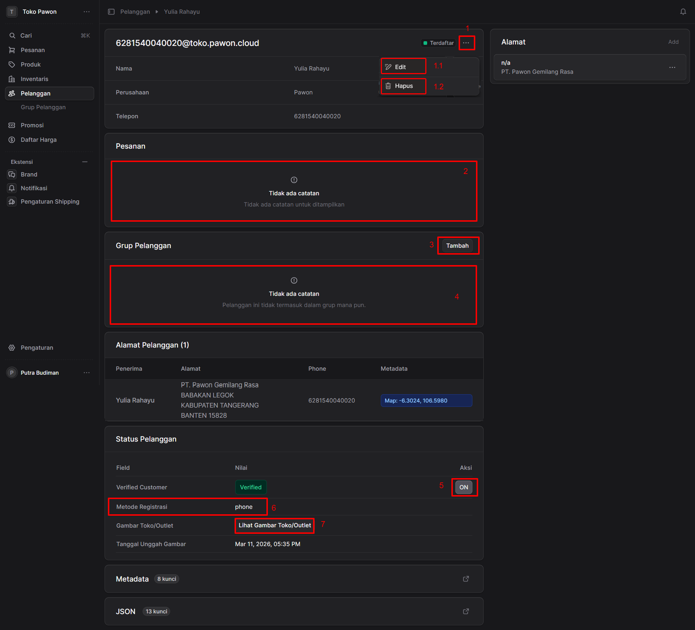

 
##  Halaman Detail Pelanggan

Halaman ini berfungsi untuk melihat dan mengelola informasi spesifik dari seorang pelanggan (pada contoh ini: Yulia Rahayu). Berikut adalah penjelasan untuk masing-masing area yang ditandai:

### 1. Menu Aksi (Tombol Titik Tiga)
Tombol ini terletak di sudut kanan atas panel informasi dasar pelanggan. Berfungsi untuk membuka menu dropdown yang berisi tindakan lanjutan untuk data pelanggan tersebut.
* **1.1 Tombol "Edit"**: Berfungsi untuk mengubah atau memperbarui informasi dasar pelanggan, seperti Nama, Perusahaan, dan Nomor Telepon.
* **1.2 Tombol "Hapus"**: Berfungsi untuk menghapus data pelanggan ini dari sistem database Anda.

---

### 2. Panel Pesanan (Order History)
Area ini didedikasikan untuk menampilkan riwayat transaksi atau pesanan yang pernah dibuat oleh pelanggan tersebut. 
* **Kondisi Saat Ini**: Tertulis **"Tidak ada catatan"**, yang mengindikasikan bahwa pelanggan ini belum pernah melakukan pemesanan atau transaksi apa pun di toko Anda.

---

### 3 & 4. Panel Grup Pelanggan (Customer Group)
Bagian ini digunakan untuk mengelompokkan pelanggan ke dalam kategori atau segmentasi tertentu (misalnya: Reseller, VIP, dll).
* **3. Tombol "Tambah"**: Digunakan untuk memasukkan pelanggan ini ke dalam grup pelanggan baru atau grup yang sudah ada.
* **4. Daftar Grup**: Area tampilan yang menunjukkan pelanggan ini tergabung di grup mana saja. Saat ini tertulis **"Tidak ada catatan"**, yang berarti pelanggan belum dimasukkan ke grup mana pun.

---

### 5, 6 & 7. Panel Status Pelanggan
Panel ini menampilkan detail teknis terkait status akun, proses verifikasi, dan kelengkapan data dari pelanggan.
* **5. Tombol Toggle "Verified Customer" (ON)**: Sebuah sakelar (*toggle*) aksi untuk mengubah status verifikasi pelanggan. Karena statusnya menunjukkan **ON**, ini berarti akun pelanggan telah berhasil diverifikasi oleh sistem atau admin.
* **6. Field "Metode Registrasi"**: Menunjukkan jalur atau metode yang digunakan pelanggan saat pertama kali mendaftar. Pada contoh ini, nilainya adalah **phone**, yang berarti pelanggan mendaftar menggunakan nomor telepon.
* **7. Tautan "Lihat Gambar Toko/Outlet"**: Sebuah tombol/tautan aksi yang dapat diklik untuk melihat lampiran foto toko atau outlet milik pelanggan. (Terdapat informasi waktu unggah di bawahnya, yaitu Mar 11, 2026).

 