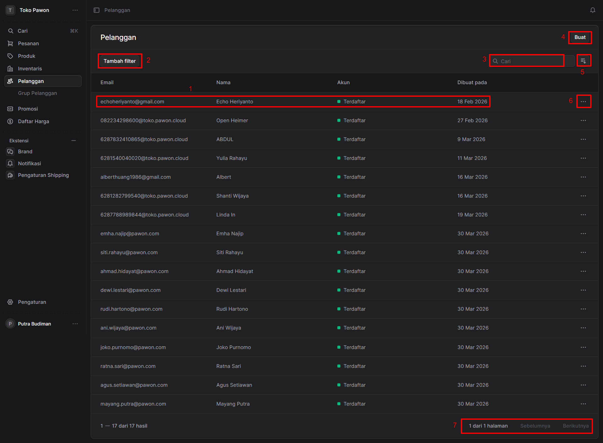

## Halaman Daftar Pelanggan

Halaman **Pelanggan** berfungsi sebagai pusat kendali untuk melihat, mencari, dan mengelola data pelanggan yang terdaftar di sistem "Toko Pawon". 

Berikut adalah penjelasan fungsi dari masing-masing elemen antarmuka yang ditandai dengan nomor pada gambar:

### 1. Baris Data Pelanggan (Customer Record)
Area ini menampilkan informasi ringkas mengenai satu entitas pelanggan. Informasi yang disajikan dalam tabel meliputi:
* **Email:** Alamat email kontak pelanggan.
* **Nama:** Nama lengkap atau nama panggilan pelanggan.
* **Akun:** Status keanggotaan/akun pelanggan (contoh: *Terdaftar*).
* **Dibuat pada:** Tanggal kapan data pelanggan tersebut ditambahkan atau mendaftar ke dalam sistem.

### 2. Tombol "Tambah Filter"
Fitur ini digunakan untuk menyaring daftar pelanggan berdasarkan kriteria tertentu (misalnya: memfilter hanya pelanggan yang mendaftar bulan ini, atau status akun tertentu). Ini sangat berguna ketika Anda memiliki basis data pelanggan yang besar dan ingin mengelompokkannya secara spesifik.

### 3. Kolom Pencarian ("Cari")
Gunakan kolom ini untuk mencari pelanggan secara cepat. Anda dapat mengetikkan kata kunci seperti nama pelanggan atau alamat email, dan sistem akan langsung menampilkan hasil yang relevan di tabel bawahnya.

### 4. Tombol "Buat"
Tombol ini berfungsi untuk menambahkan data pelanggan baru ke dalam sistem secara manual. Mengeklik tombol ini biasanya akan membuka formulir pendaftaran pelanggan baru.

### 5. Ikon Pengurutan/Tampilan (Sort)
Ikon di sebelah kanan kolom pencarian ini digunakan untuk mengatur urutan tampilan data di dalam tabel (misalnya: mengurutkan berdasarkan nama dari A-Z, atau berdasarkan tanggal pendaftaran terbaru ke terlama).

### 6. Menu Tindakan (Ikon Tiga Titik)
Tombol ini berada di ujung kanan setiap baris data pelanggan. Mengeklik ikon ini akan membuka menu tarik-turun (dropdown) yang berisi opsi tindakan spesifik untuk pelanggan tersebut, seperti:
* Melihat detail lengkap pelanggan.
* Mengedit informasi pelanggan.
* Menghapus data pelanggan.

### 7. Paginasi (Navigasi Halaman)
Bagian ini terletak di sudut kanan bawah tabel dan menunjukkan informasi letak halaman saat ini (contoh: **"1 dari 1 halaman"**). Jika jumlah pelanggan melebihi kapasitas satu halaman (lebih dari 17 baris), Anda dapat menggunakan tombol **"Sebelumnya"** dan **"Berikutnya"** untuk berpindah antar halaman daftar pelanggan.