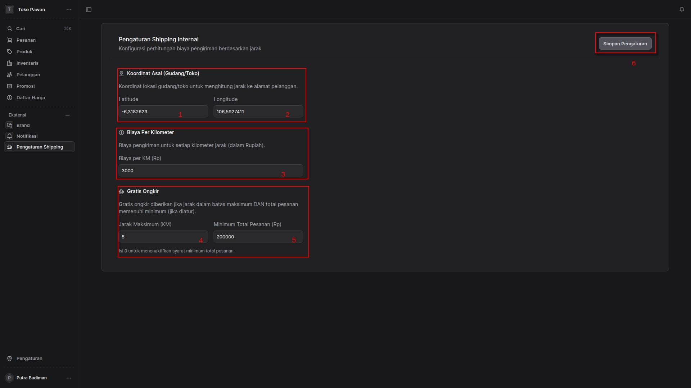
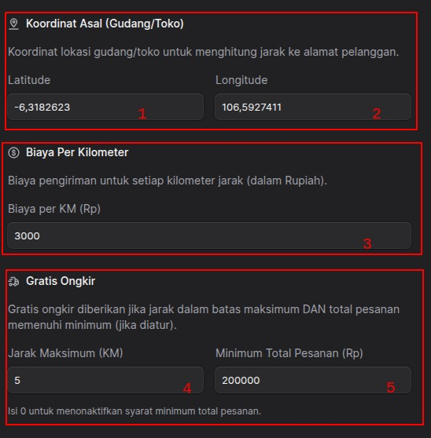
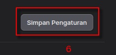

## Pengaturan Shipping Internal

**Deskripsi Fitur:**
Halaman ini berfungsi untuk mengonfigurasi sistem perhitungan biaya pengiriman internal toko. Sistem ini akan menghitung ongkos kirim secara otomatis berdasarkan jarak (kilometer) dari lokasi gudang/toko ke alamat pengiriman pelanggan.

---

### Penjelasan Elemen Antarmuka (Berdasarkan Nomor pada Gambar)

#### 📍 Koordinat Asal (Gudang/Toko)
Bagian ini digunakan untuk menentukan titik awal pengiriman. Sistem akan menggunakan titik ini untuk mengukur jarak ke alamat pembeli.
* **1. Latitude (Garis Lintang):** Masukkan titik koordinat garis lintang lokasi toko Anda. Pada contoh di atas, nilainya diisi dengan `-6,3182623`.
* **2. Longitude (Garis Bujur):** Masukkan titik koordinat garis bujur lokasi toko Anda. Pada contoh di atas, nilainya diisi dengan `106,5927411`.
Nilai ini adalah koordinat kantor Toko Pawon.

#### 💰 Biaya Per Kilometer
Bagian ini mengatur tarif dasar pengiriman yang akan dibebankan kepada pelanggan.
* **3. Biaya per KM (Rp):** Tentukan nominal biaya pengiriman untuk setiap kilometernya (dalam mata uang Rupiah).
    * *Contoh pada gambar:* Diatur sebesar **Rp 3.000**. Jika jarak pelanggan adalah 3 KM, maka ongkos kirim standarnya adalah Rp 9.000.

#### 🚚 Gratis Ongkir
Bagian ini digunakan untuk mengatur promo bebas biaya kirim dengan syarat dan ketentuan tertentu. Agar gratis ongkir berlaku, pesanan harus memenuhi **kedua** syarat di bawah ini:
* **4. Jarak Maksimum (KM):** Batas jarak terjauh dari toko yang masih masuk ke dalam cakupan gratis ongkir.
    * *Contoh pada gambar:* Diatur maksimal **5 KM**. Pelanggan dengan jarak 6 KM tidak akan mendapatkan promo ini.
* **5. Minimum Total Pesanan (Rp):** Syarat nilai belanja paling sedikit agar gratis ongkir aktif.
    * *Contoh pada gambar:* Diatur sebesar **Rp 200.000**.
    * > **Catatan Penting:** Jika Anda tidak ingin menggunakan syarat minimum belanja (semua pesanan dalam jarak maksimum otomatis gratis ongkir), Anda bisa mengisi kolom ini dengan angka **0**.

#### 💾 Tombol Aksi

* **6. Simpan Pengaturan:** Setelah Anda selesai mengubah atau memastikan semua nilai konfigurasi di atas sudah benar, klik tombol ini yang berada di pojok kanan atas untuk menyimpan pengaturan ke dalam sistem.