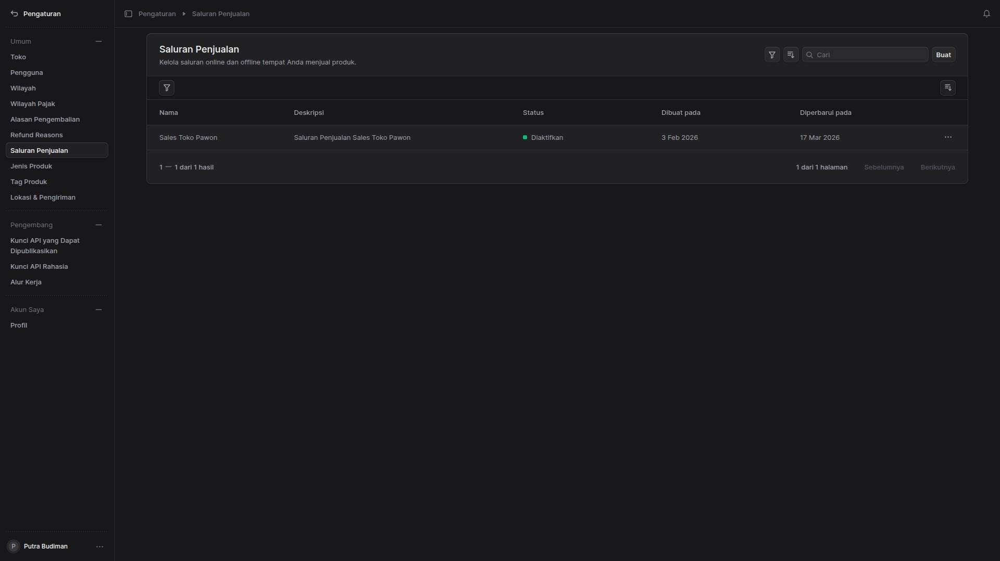
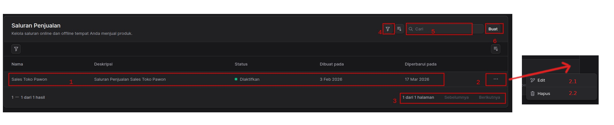
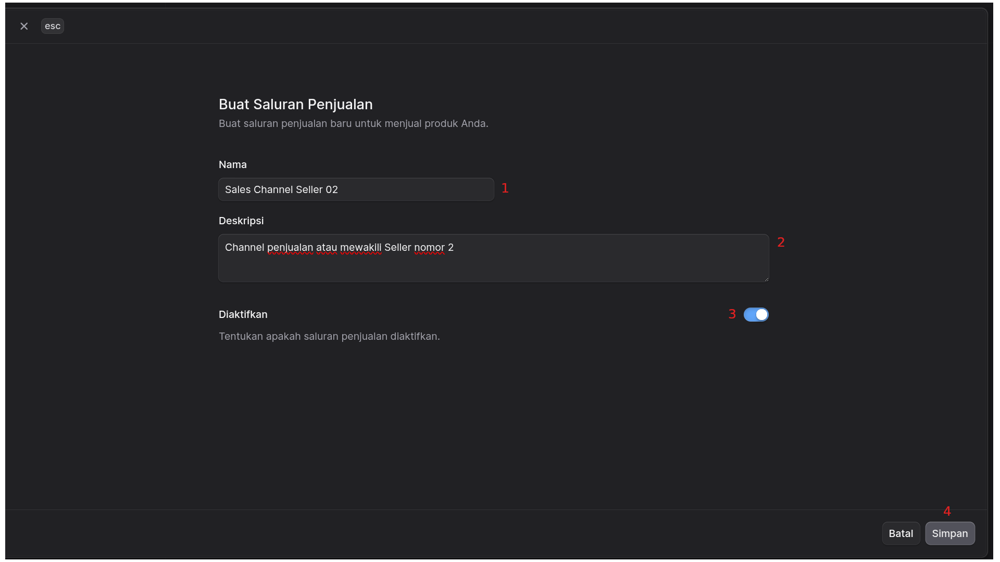
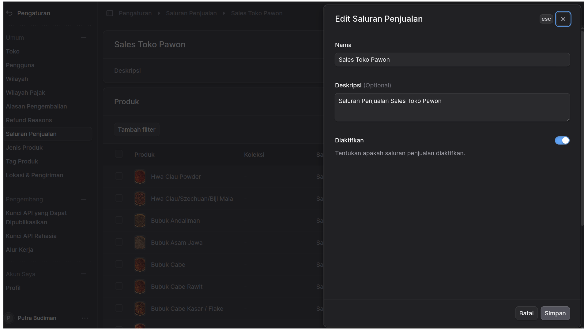
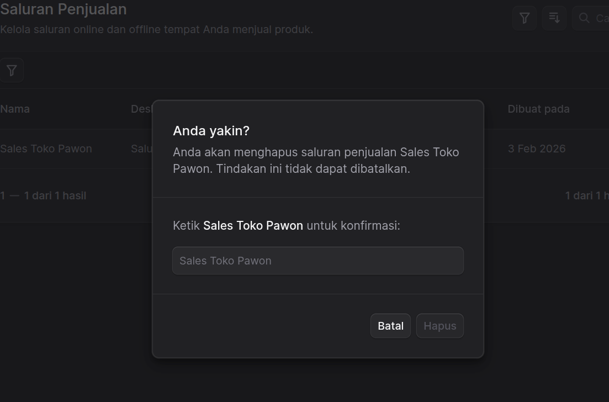

---

## Panduan Pengguna: Manajemen Saluran Penjualan

Halaman ini berfungsi untuk mengelola seluruh saluran penjualan  yang Anda gunakan untuk memasarkan produk. Anda dapat memantau status, memperbarui informasi, atau menambah saluran baru melalui dasbor ini.

### 1. Informasi Daftar Saluran (Tabel Utama)
Pada area nomor **1**, Anda dapat melihat daftar seluruh saluran penjualan yang telah terdaftar. Informasi yang ditampilkan meliputi:
* **Nama:** Identitas dari saluran penjualan (contoh: "Sales Toko Pawon").
* **Deskripsi:** Keterangan singkat mengenai fungsi atau detail saluran tersebut.
* **Status:** Menunjukkan apakah saluran tersebut sedang aktif (**Diaktifkan**) atau nonaktif.
* **Dibuat pada:** Tanggal pertama kali saluran didaftarkan.
* **Diperbarui pada:** Tanggal terakhir kali ada perubahan data pada saluran tersebut.

### 3. Navigasi Halaman (Pagination)
Area nomor **3** digunakan untuk berpindah antar halaman jika Anda memiliki banyak saluran penjualan. Anda dapat melihat jumlah total halaman dan menggunakan tombol **Sebelumnya** atau **Berikutnya** untuk navigasi.

### 4. Fitur Pencarian dan Filter
Untuk mempermudah pencarian data spesifik, gunakan fitur berikut:
* **Filter (4):** Digunakan untuk menyaring tampilan berdasarkan kriteria tertentu (seperti status aktif/tidak aktif).
* **Cari (5):** Masukkan kata kunci (nama atau deskripsi) pada kolom pencarian untuk menemukan saluran tertentu secara cepat.
* **Urutkan (6):** Mengatur urutan tampilan data berdasarkan kriteria tertentu (misal: berdasarkan tanggal terbaru atau nama alfabet).

### 5. Menambah Saluran Baru
* **Tombol Buat (6):** Klik tombol **"Buat"** yang terletak di pojok kanan atas untuk mendaftarkan saluran penjualan baru ke dalam sistem.
## Pembuatan Saluran Penjualan Baru
---

**Tujuan:** Panduan ini digunakan untuk menambahkan saluran penjualan baru ke dalam sistem yang nantinya akan digunakan untuk menjual produk Anda.

### Rincian Form Input & Tombol

Berikut adalah penjelasan untuk setiap elemen yang ditandai dengan angka merah pada layar formulir **"Buat Saluran Penjualan"**:

* **1. Nama**
    * **Fungsi:** Digunakan untuk memberikan identitas atau nama utama pada saluran penjualan yang baru dibuat.
    * **Tindakan:** Ketikkan nama saluran penjualan pada kolom teks yang tersedia.
    * *Contoh pada gambar:* `Sales Channel Seller 02`

* **2. Deskripsi**
    * **Fungsi:** Digunakan untuk memberikan informasi, catatan tambahan, atau detail lebih lanjut mengenai fungsi saluran penjualan tersebut.
    * **Tindakan:** Ketikkan penjelasan secara deskriptif pada kotak teks (*text area*).
    * *Contoh pada gambar:* `Channel penjualan atau mewakili Seller nomor 2`

* **3. Diaktifkan**
    * **Fungsi:** Menentukan status operasional (aktif/non-aktif) dari saluran penjualan yang sedang dibuat.
    * **Tindakan:** Klik tombol *toggle* (geser) untuk mengatur statusnya. Jika *toggle* menyala berwarna biru (seperti pada gambar), artinya saluran penjualan dalam keadaan **Aktif** dan bisa digunakan.

* **4. Tombol Aksi (Simpan / Batal)**
    * **Fungsi:** Mengeksekusi penyelesaian pengisian formulir.
    * **Tindakan:** * Klik tombol **Simpan** untuk memvalidasi dan menyimpan data saluran penjualan baru tersebut ke dalam *database* sistem.
        * Klik tombol **Batal** untuk membatalkan proses pengisian dan menutup formulir tanpa menyimpan data apa pun.

> **Catatan Tambahan:** Anda juga dapat menggunakan tombol **`x esc`** yang berada di pojok kiri atas jendela formulir untuk menutup tampilan dengan cepat (membatalkan proses).

### 2. Aksi dan Kontrol Baris
Untuk mengelola data pada setiap baris saluran penjualan, Anda dapat menggunakan menu aksi di sisi kanan:
* **Menu Opsi (2):** Klik ikon titik tiga untuk membuka menu bantuan.
    * **Edit (2.1):** Mengubah informasi atau detail dari saluran penjualan yang sudah ada. 

## Edit Saluran Penjualan

Jendela *pop-up* (modal) **"Edit Saluran Penjualan"** digunakan oleh administrator atau pengguna dengan hak akses terkait untuk mengubah detail informasi dari sebuah saluran penjualan yang sudah terdaftar di dalam sistem.

### 📝 Deskripsi Kolom Formulir

Jendela ini berisi beberapa elemen yang dapat disesuaikan oleh pengguna:

* **Nama**
    * **Fungsi:** Kolom teks (text input) untuk mengubah nama saluran penjualan.
    * **Contoh pada gambar:** "Sales Toko Pawon".
    * **Status:** Wajib diisi (tidak ada label opsional).
* **Deskripsi (Optional)**
    * **Fungsi:** Kotak teks area (text area) untuk memberikan penjelasan, catatan, atau rincian tambahan mengenai saluran penjualan tersebut.
    * **Contoh pada gambar:** "Saluran Penjualan Sales Toko Pawon".
    * **Status:** Opsional (tidak wajib diisi).
* **Diaktifkan**
    * **Fungsi:** Tombol sakelar (*toggle switch*) untuk mengatur status aktif atau tidaknya saluran penjualan ini di dalam sistem.
    * **Indikator:**
        * **Warna Biru (Posisi Kanan):** Saluran Penjualan sedang dalam status **Aktif**.
        * **Warna Abu-abu (Posisi Kiri):** Saluran Penjualan sedang dalam status **Nonaktif**.
    * **Keterangan di layar:** "Tentukan apakah saluran penjualan diaktifkan."

### ⚙️ Tindakan (Tombol Aksi)

Di bagian sudut kanan atas dan kanan bawah terdapat tombol aksi untuk mengelola perubahan formulir:

* **Simpan:** Tombol utama (primary button) untuk menyimpan semua perubahan teks dan status yang telah dilakukan pada jendela ini ke dalam sistem.
* **Batal:** Tombol sekunder (secondary button) untuk membatalkan semua perubahan dan menutup jendela *pop-up* ini.
* **Tombol "X" (esc):** Terdapat di sudut kanan atas. Memiliki fungsi yang sama dengan tombol "Batal", yaitu menutup jendela tanpa menyimpan perubahan. Bisa diakses dengan mengklik ikon 'X' atau menekan tombol `Esc` pada keyboard.

## **Hapus (2.2):** Menghapus saluran penjualan dari sistem.

Fitur ini digunakan untuk menghapus saluran penjualan yang sudah tidak aktif atau tidak diperlukan lagi. Harap diperhatikan bahwa tindakan ini bersifat **permanen** dan tidak dapat dibatalkan.

### Langkah-langkah Penghapusan

1.  **Pemicu Penghapusan:**
    Pada halaman daftar **Saluran Penjualan**, pilih data yang ingin dihapus (dalam contoh: *Sales Toko Pawon*). Klik ikon atau tombol hapus yang tersedia hingga muncul jendela konfirmasi (pop-up).

2.  **Konfirmasi Keamanan:**
    Sistem akan menampilkan dialog konfirmasi bertajuk **"Anda yakin?"** untuk mencegah penghapusan yang tidak disengaja. Pesan peringatan akan muncul:
    > *"Anda akan menghapus saluran penjualan [Nama Saluran]. Tindakan ini tidak dapat dibatalkan."*

3.  **Verifikasi Nama:**
    Untuk mengaktifkan tombol hapus, Anda wajib mengetikkan kembali nama saluran penjualan secara tepat pada kolom input yang tersedia.
    * **Contoh:** Ketik `Sales Toko Pawon`

4.  **Eksekusi:**
    * Klik tombol **Hapus** (yang akan aktif setelah teks verifikasi sesuai) untuk memproses penghapusan secara permanen.
    * Klik tombol **Batal** jika Anda ingin membatalkan proses dan kembali ke halaman sebelumnya tanpa perubahan.

---

### Informasi Detail Modul

| Elemen | Deskripsi |
| :--- | :--- |
| **Nama Saluran** | Sales Toko Pawon |
| **Tanggal Dibuat** | 3 Feb 2026 |
| **Status Tindakan** | Irreversible (Tidak dapat dikembalikan) |

> **Peringatan Penting:** Menghapus saluran penjualan dapat berdampak pada data transaksi atau integrasi yang terhubung dengan saluran tersebut. Pastikan Anda telah melakukan backup data jika diperlukan sebelum melanjutkan.

---

**Tips:** *Pastikan status saluran selalu dalam keadaan "Diaktifkan" agar transaksi dari saluran tersebut dapat tercatat dengan benar di sistem pusat.*

