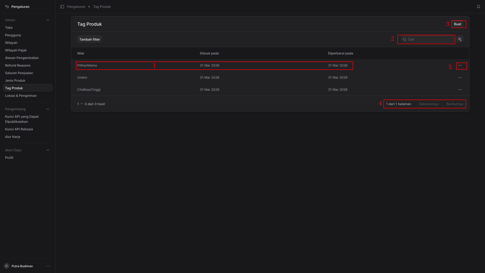
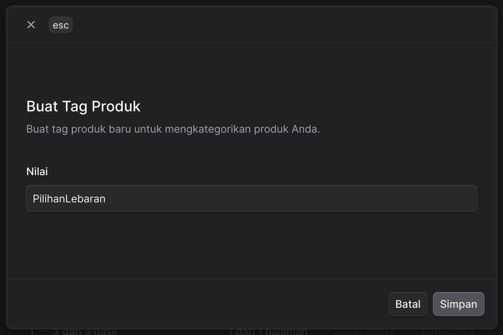
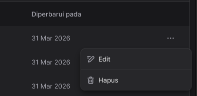
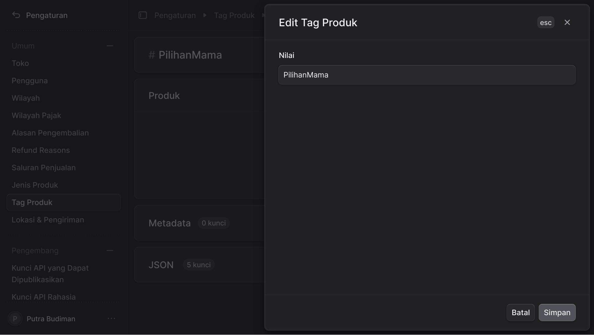
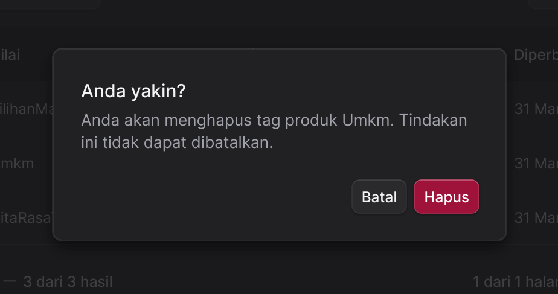

Dokumentasi ini menjelaskan fungsi-fungsi dari antarmuka pengguna sesuai dengan nomor yang ditandai dengan kotak merah pada gambar:

Halaman ini berfungsi untuk mengelola (melihat, menambah, mencari, dan memodifikasi) daftar kategori atau tag produk yang tersedia di dalam sistem.

**Fungsi Berdasarkan Penanda Nomor:**

* **1. Baris Data (Data Row)**
    Area ini menampilkan daftar tag produk yang sudah terdaftar. Setiap baris memuat informasi mengenai:
    * **Nilai:** Nama dari tag produk tersebut (contoh: PilihanMama, Umkm, CitaRasaTinggi).
    * **Dibuat pada:** Tanggal kapan data tag produk tersebut ditambahkan ke sistem.
    * **Diperbarui pada:** Tanggal kapan data tersebut terakhir kali diubah atau dimodifikasi.

* **2. Kolom Pencarian (Search Bar)**
    Fitur pencarian yang terletak di sudut kanan atas tabel. Anda dapat mengetikkan kata kunci (nama tag produk) di kolom **"Cari"** ini untuk menyaring dan menemukan data spesifik dengan cepat dari daftar yang panjang.

* **3. Tombol "Buat" (Create Button)**
    Tombol ini digunakan untuk membuat entri data baru. Dengan mengklik tombol **"Buat"**, sistem biasanya akan membuka formulir atau *pop-up* baru di mana Anda bisa memasukkan nama tag produk baru ke dalam sistem.
    

* **4. Navigasi Halaman (Pagination)**
    Fitur ini berada di sudut kanan bawah dan berfungsi untuk navigasi jika jumlah data melebihi batas yang bisa ditampilkan dalam satu halaman.
    * **1 dari 2 halaman:** Menunjukkan posisi Anda saat ini berada di halaman pertama dari total dua halaman.
    * **Sebelumnya / Berikutnya:** Tombol yang dapat diklik untuk berpindah ke halaman sebelumnya atau melihat daftar data di halaman selanjutnya.

* **5. Menu Aksi Tambahan (Action Menu)**

    
    
    Tombol dengan ikon tiga titik horizontal (`...`) yang berada di ujung paling kanan setiap baris data. Jika tombol ini diklik, ia akan memunculkan menu *dropdown* yang umumnya berisi tindakan spesifik untuk baris data tersebut, seperti opsi untuk **Ubah** (Edit) atau **Hapus** (Delete) tag produk yang bersangkutan.
    
    

