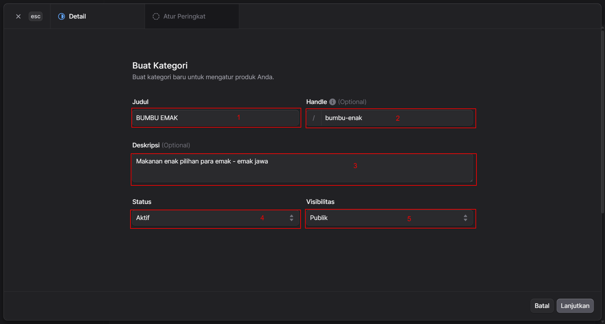
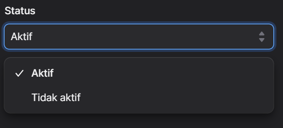
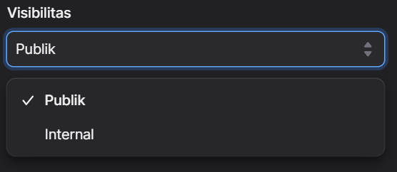
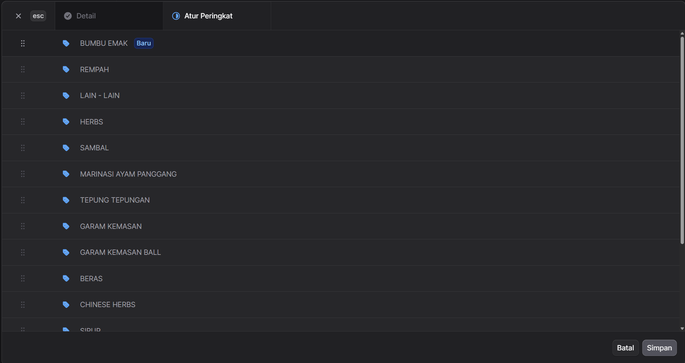
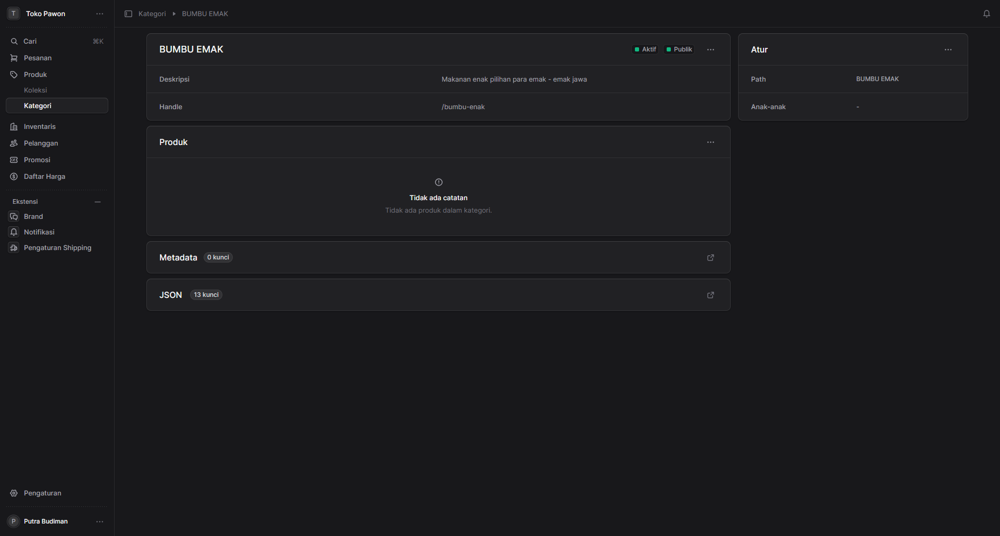

## Pembuatan Kategori Produk

**Fungsi Utama:** Halaman form ini digunakan oleh pengguna untuk membuat kategori baru yang berfungsi mengatur dan mengelompokkan produk di dalam sistem.

---

### Penjelasan Kolom Pengisian

Berdasarkan penomoran kotak merah pada gambar, berikut adalah rincian masing-masing kolom:

* **1. Judul**
    * **Fungsi:** Kolom wajib isi untuk menentukan nama utama dari kategori yang akan dibuat.
    * **Contoh Pengisian:** `BUMBU EMAK`
* **2. Handle (Optional)**
    * **Fungsi:** Kolom opsional untuk menentukan *URL slug* atau *path* tautan spesifik untuk kategori tersebut (biasanya muncul setelah garis miring `/`). Berguna untuk kebutuhan SEO atau penamaan tautan agar lebih rapi.
    * **Contoh Pengisian:** `bumbu-enak`
* **3. Deskripsi (Optional)**
    * **Fungsi:** Kolom teks area opsional untuk memberikan rincian, penjelasan, atau catatan tambahan mengenai kategori produk tersebut.
    * **Contoh Pengisian:** `Makanan enak pilihan para emak - emak jawa`
* **4. Status**

    

    * **Fungsi:** Menu *dropdown* (tarik-turun) untuk mengatur status sistem operasional dari kategori.
    * **Contoh Pengisian:** `Aktif` (Menandakan kategori ini sedang digunakan dan berjalan di sistem).
* **5. Visibilitas**

    

    * **Fungsi:** Menu *dropdown* untuk mengatur hak akses atau keterlihatan kategori ini oleh pihak luar atau pelanggan.
    * **Contoh Pengisian:** `Publik` (Menandakan kategori ini dapat dilihat oleh semua pengunjung atau pelanggan umum).

---

### Tombol Aksi (Action Buttons)

Pada bagian kanan bawah antarmuka, terdapat dua tombol eksekusi:

* **Batal:** Tombol untuk membatalkan proses pengisian dan keluar dari form pembuatan kategori tanpa menyimpan perubahan.
* **Lanjutkan:** Tombol navigasi untuk menyimpan data yang telah diisi pada tab "Detail" ini dan kemungkinan melanjutkan ke proses selanjutnya (seperti tab "Atur Peringkat").

Untuk melakukan pengurutan, silahkan klik dan tahan pada ikon titik enam pada baris kategori yang ingin diurutkan, lalu seret ke posisi yang diinginkan.

Selanjutnya klik tombol "Simpan" untuk menyimpan perubahan.

Setelah itu Anda akan dialihkan ke halaman detail kategori produk yang baru saja dibuat.

