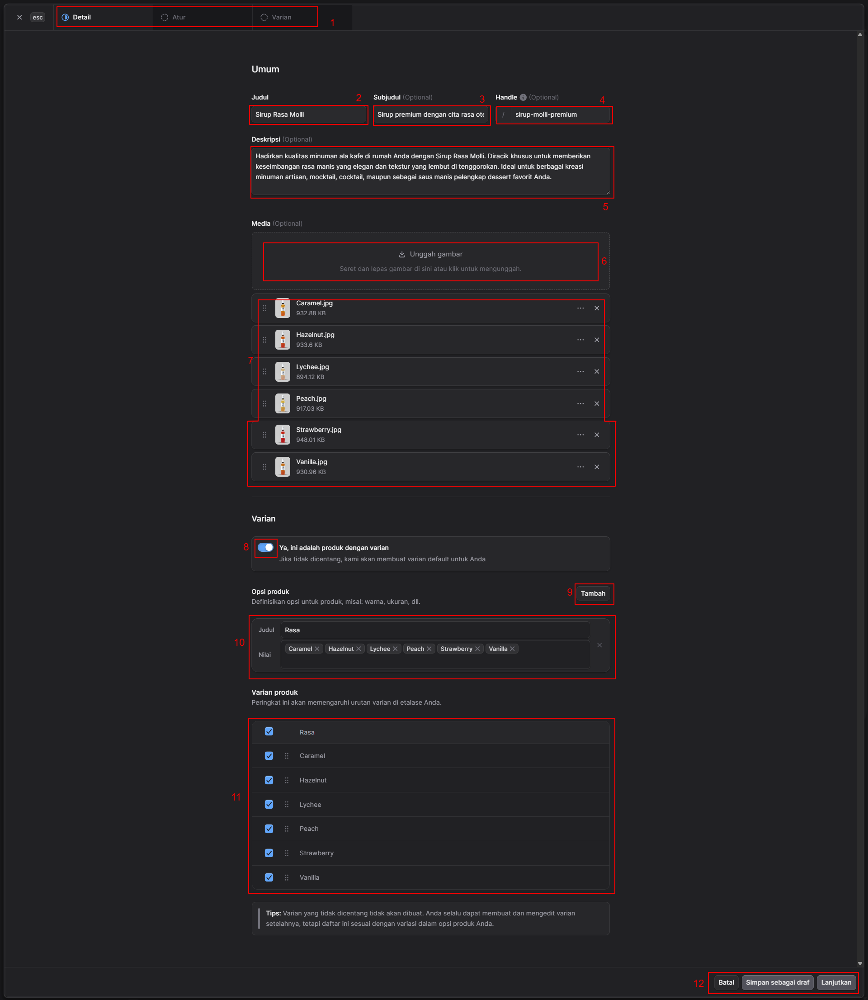
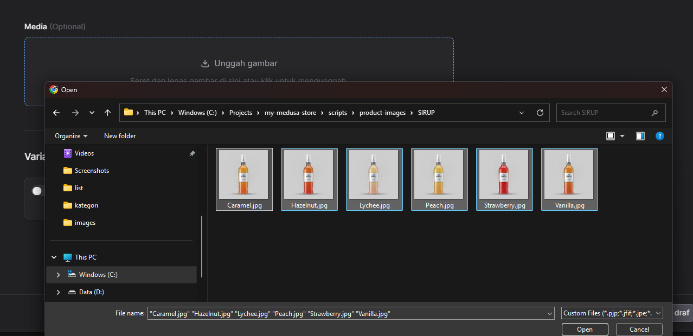
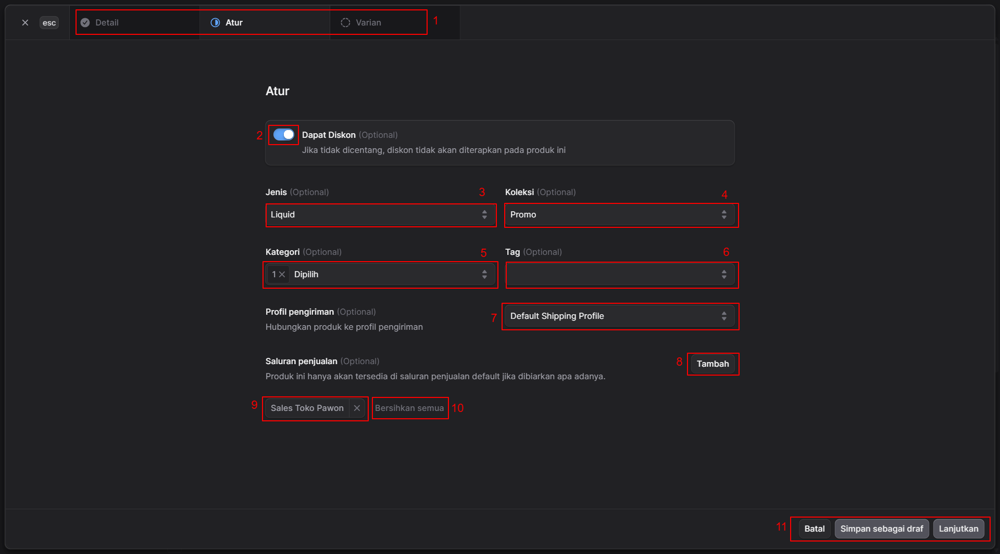
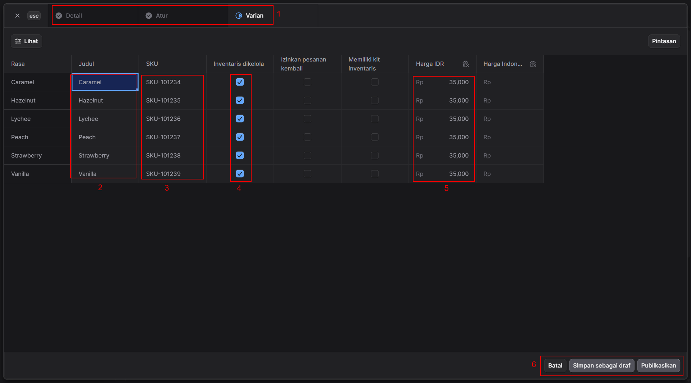

# Menambah Produk Baru (Multi Varian)

Untuk menambah item produk baru Anda bisa pergi ke [Manajemen Produk](manage.md) Link ke aplikasi admin : <a href="https://store.pawon.cloud/app/products" target="_blank">https://store.pawon.cloud/app/products</a> dan menekan tombol nomor 4 seperti gambar berikut:

 

Setelah Anda menekan tombol ini maka akan muncul form pembuatan item produk baru berikut:

 

**Penambahan Item Produk Multi Varian (Tahap 1 - Detail)**  

Dokumentasi ini dirancang untuk memudahkan pengguna memahami setiap fungsi kolom saat menambahkan produk baru, khususnya produk yang memiliki variasi.

### Bagian Navigasi & Informasi Umum (Umum)

* **1. Tab Langkah / Navigasi**
    Menunjukkan posisi pengguna saat ini dalam proses pembuatan produk. Gambar menunjukkan pengguna berada pada tab **Detail**. Tab selanjutnya adalah **Atur** dan **Varian**.
* **2. Judul**
    Kolom teks untuk memasukkan nama utama produk. Nama ini yang akan paling menonjol dilihat oleh pelanggan. *(Contoh: Sirup Rasa Molli)*.
* **3. Subjudul (Opsional)**
    Kolom teks untuk menambahkan deskripsi singkat, *tagline*, atau nilai jual utama produk secara ringkas. *(Contoh: Sirup premium dengan cita rasa...)*.
* **4. Handle (Opsional)**
    Berfungsi untuk mengatur URL khusus (tautan web) untuk produk ini. Jika dibiarkan kosong, sistem biasanya akan membuat tautan secara otomatis berdasarkan 'Judul'. Format penulisannya menggunakan tanda hubung. *(Contoh: `/sirup-molli-premium`)*.
* **5. Deskripsi (Opsional)**
    Area teks luas untuk menjelaskan produk secara rinci. Anda dapat menuliskan spesifikasi, cara penggunaan, keunggulan, atau komposisi produk di sini.

---

### Bagian Media

* **6. Area Unggah Gambar**

    

    Area fungsional untuk menambahkan foto atau video produk. Pengguna dapat mengeklik area kotak putus-putus untuk memilih *file* dari perangkat, atau cukup menyeret (*drag*) dan melepas (*drop*) *file* gambar ke area tersebut.

* **7. Daftar Media yang Diunggah**

    Menampilkan daftar gambar yang telah berhasil diunggah. Pada bagian ini, pengguna dapat melakukan beberapa tindakan:
    * Melihat nama dan ukuran *file* (misal: Caramel.jpg, 932.88 KB).
    * Mengubah urutan gambar dengan menahan dan menggeser ikon titik enam di sebelah kiri gambar.
    * Membuka opsi tambahan melalui ikon titik tiga.
    * Menghapus gambar dengan mengeklik ikon **X** di sebelah kanan.

---

### Bagian Varian Produk

* **8. Tombol Aktifasi Varian**
    Sebuah *toggle* (sakelar) yang harus diaktifkan (dicentang biru) jika produk yang dijual memiliki beberapa pilihan berbeda, seperti rasa, ukuran, atau warna.
* **9. Tombol Tambah Opsi**
    Digunakan untuk menambahkan kategori varian baru. Klik tombol ini jika produk memiliki lebih dari satu jenis varian (misalnya: produk ini memiliki varian 'Rasa' dan juga varian 'Ukuran Kemasan').
* **10. Pengaturan Opsi Produk**
    Tempat untuk mendefinisikan varian produk secara spesifik.
    * **Judul:** Nama kategori variasi (contoh: Rasa).
    * **Nilai:** Pilihan yang tersedia dalam kategori tersebut. Ketik nama varian (seperti Caramel, Hazelnut, Lychee) lalu tekan *Enter* atau koma untuk mengubahnya menjadi *tag* (label abu-abu). Anda bisa menghapus *tag* dengan mengeklik tanda 'x' pada masing-masing label.
* **11. Daftar Varian Produk (Hasil Akhir)**
    Daftar ini dihasilkan secara otomatis berdasarkan nilai yang Anda masukkan di nomor 10. Di sini Anda dapat:
    * **Mencentang/Menghapus Centang:** Pilih kotak biru di sebelah kiri untuk menentukan varian mana saja yang benar-benar akan dibuat dan dijual. Varian yang tidak dicentang tidak akan ditampilkan ke pembeli.
    * **Mengurutkan:** Gunakan ikon titik enam untuk mengubah urutan tampilan varian (mana yang muncul lebih dulu) di halaman toko Anda.

---

### Bagian Navigasi Bawah (Aksi)

* **12. Tombol Aksi Formulir**
    Kumpulan tombol untuk memproses data yang telah diisi:
    * **Batal:** Keluar dari halaman pembuatan produk tanpa menyimpan perubahan.
    * **Simpan sebagai draf:** Menyimpan data produk yang sudah diisi agar bisa dilanjutkan nanti, namun produk belum dipublikasikan ke toko.
    * **Lanjutkan:** Menyimpan data di tab "Detail" dan berpindah ke langkah selanjutnya (tab "Atur" atau "Varian").

**Penambahan Item Produk (Tahap 2 - Atur)**

Pada tahap ini, Anda mengatur detail produk.

### Bagian Navigasi

* **1. Indikator Langkah (Tab Navigasi)**
    Menunjukkan posisi Anda dalam proses pembuatan produk. Saat ini Anda berada di tahap kedua, yaitu **Atur** (ditandai dengan titik biru). Tahap **Detail** sebelumnya telah selesai (ditandai dengan ikon centang), dan tahap terakhir yang harus diselesaikan setelah ini adalah **Varian**.

---

### Bagian Pengaturan Utama (Atur)

* **2. Sakelar "Dapat Diskon" (Opsional)**
    Sebuah *toggle* untuk menentukan ketersediaan diskon. Jika diaktifkan (dicentang biru), produk ini diizinkan untuk diikutsertakan dalam program potongan harga. Jika tidak dicentang, sistem tidak akan menerapkan diskon apa pun pada produk ini meskipun ada promo yang berjalan.
* **3. Jenis (Opsional)**
    Kolom *dropdown* untuk mengklasifikasikan tipe dasar dari produk Anda. *(Contoh pada gambar: Liquid)*. Untuk mengatur jenis produk Anda bisa pergi ke [Jenis Produk](../pengaturan/jenis-produk.md).
* **4. Koleksi (Opsional)**
    Kolom *dropdown* untuk memasukkan produk ke dalam kelompok koleksi tertentu di toko Anda. Ini sangat membantu pelanggan saat mencari produk dengan tema yang sama. *(Contoh pada gambar: Promo)* . Untuk mengatur koleksi produk Anda bisa pergi ke [Koleksi Produk](koleksi.md).
* **5. Kategori (Opsional)**
    Kolom pilihan untuk menentukan kategori spesifik produk dalam hierarki toko. Anda bisa memilih satu atau beberapa kategori sekaligus. *(Pada gambar tertulis "1 x Dipilih", artinya sudah ada 1 kategori yang dimasukkan)*. Untuk mengatur kategori produk Anda bisa pergi ke [Kategori Produk](kategori.md).
* **6. Tag (Opsional)**
    Kolom untuk menambahkan kata kunci pendukung (label). Ini sangat berguna untuk mempermudah pencarian internal toko Anda atau fitur filter produk bagi pembeli. Untuk mengatur tag produk Anda bisa pergi ke [Tag Produk](../pengaturan/tag-produk.md).

---

### Bagian Pengiriman & Saluran Penjualan

* **7. Profil Pengiriman (Opsional)**
    Kolom *dropdown* untuk menghubungkan produk dengan aturan biaya kirim tertentu. Jika toko Anda memiliki pengaturan ongkir khusus (misalnya berdasarkan lokasi gudang atau jenis barang), atur di sini. Jika tidak diubah, produk menggunakan aturan bawaan *(Default Shipping Profile)*.
* **8. Tombol "Tambah" Saluran Penjualan (Opsional)**
    Berfungsi untuk mengatur di *platform*, cabang toko, atau kasir mana saja produk ini akan dijual. Jika Anda tidak menambahkan apa pun di sini, produk secara otomatis hanya akan tersedia di saluran penjualan utama (bawaan).
* **9. Label Saluran Penjualan Terpilih**
    Menampilkan daftar saluran penjualan yang sudah Anda tambahkan. *(Contoh pada gambar: produk akan dijual di "Sales Toko Pawon")*. Anda bisa menghapus saluran tersebut secara satuan dengan mengeklik ikon **X** di sebelahnya.
* **10. Bersihkan semua**
    Tombol pintas (*shortcut*) untuk menghapus seluruh saluran penjualan yang sudah Anda pilih di nomor 9 sekaligus, sehingga kembali kosong.

---

### Bagian Navigasi Bawah (Aksi)

* **11. Tombol Aksi Formulir**
    Tombol untuk menyimpan dan melanjutkan progres Anda:
    * **Batal:** Menghentikan proses dan membuang perubahan yang belum disimpan.
    * **Simpan sebagai draf:** Menyimpan progres pengaturan Anda sebagai draf agar bisa diedit kembali nanti tanpa menampilkannya ke pelanggan.
    * **Lanjutkan:** Menyimpan semua pengaturan di tab "Atur" ini dan membawa Anda ke langkah final (tab "Varian").

**Penambahan Item Produk (Tahap 3 - Varian)**

Pada halaman ini, Anda mengatur detail spesifik seperti harga dan ketersediaan stok untuk masing-masing varian yang telah dibuat pada tahap sebelumnya.

### Bagian Navigasi

* **1. Indikator Langkah (Tab Navigasi)**
    Menunjukkan posisi Anda saat ini. Anda berada di tahap akhir, yaitu **Varian** (ditandai dengan titik biru). Tahap **Detail** dan **Atur** telah selesai disetel (ditandai dengan ikon centang abu-abu).

---

### Bagian Pengaturan Tabel Varian

Bagian ini berbentuk tabel matriks yang memungkinkan Anda mengatur setiap varian secara individual.

* **2. Judul**
    Kolom yang menampilkan nama spesifik dari masing-masing varian produk. Anda dapat mengubah nama tampilan varian di sini jika diperlukan *(Contoh pada gambar: Caramel, Hazelnut, Lychee, dll)*.
* **3. SKU (*Stock Keeping Unit*)**
    Kolom teks untuk memasukkan kode unik identifikasi barang untuk setiap varian. Kode SKU sangat penting untuk memudahkan pelacakan inventaris, pencarian di sistem gudang, atau pemindaian di kasir *(Contoh: SKU-101234)*. Setiap varian idealnya memiliki SKU yang berbeda.
* **4. Inventaris dikelola**
    Kolom berisi kotak centang (*checkbox*). Jika Anda mencentang kotak ini (warna biru), itu berarti Anda meminta sistem untuk melacak dan mengurangi jumlah stok varian ini secara otomatis setiap kali ada penjualan.
* **5. Harga IDR**
    Kolom untuk menetapkan harga jual untuk masing-masing varian dalam mata uang Rupiah. Pada format produk multi-varian, Anda memiliki fleksibilitas untuk memberikan harga yang sama untuk semua varian *(seperti pada gambar, semuanya Rp 35.000)*, atau menetapkan harga yang berbeda-beda jika ada varian premium yang lebih mahal.

---

### Bagian Navigasi Bawah (Aksi)

* **6. Tombol Aksi Formulir**
    Kumpulan tombol penyelesaian. Karena ini adalah langkah terakhir, opsinya sedikit berbeda dari tahap sebelumnya:
    * **Batal:** Membatalkan seluruh proses pembuatan produk dan kembali ke halaman sebelumnya.
    * **Simpan sebagai draf:** Menyimpan semua data dari Tahap 1 hingga Tahap 3 sebagai draf (belum tayang ke pelanggan).
    * **Publikasikan:** Tombol final untuk menyimpan semua pengaturan dan langsung menayangkan atau menjual produk beserta seluruh variannya di toko Anda.