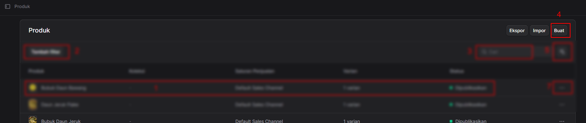
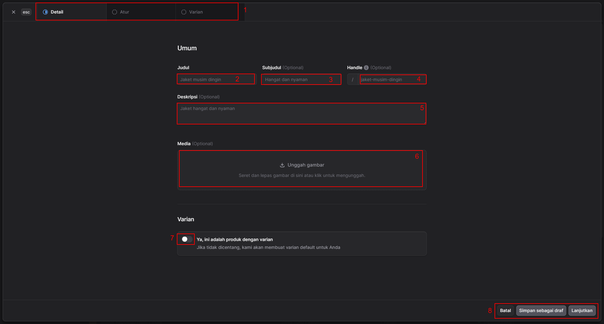
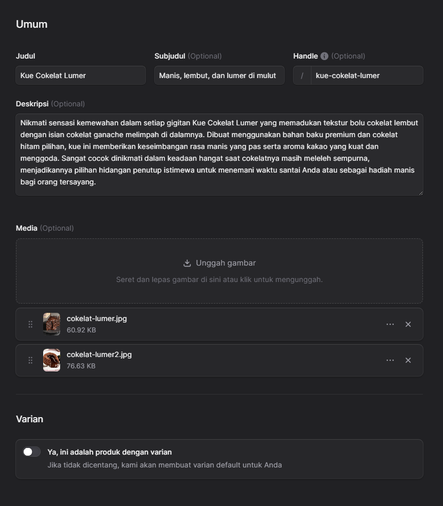
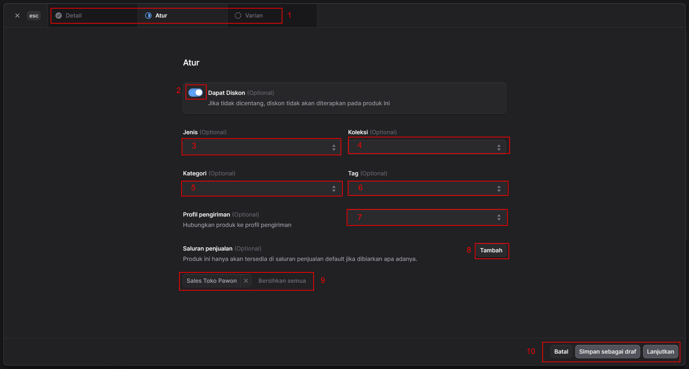
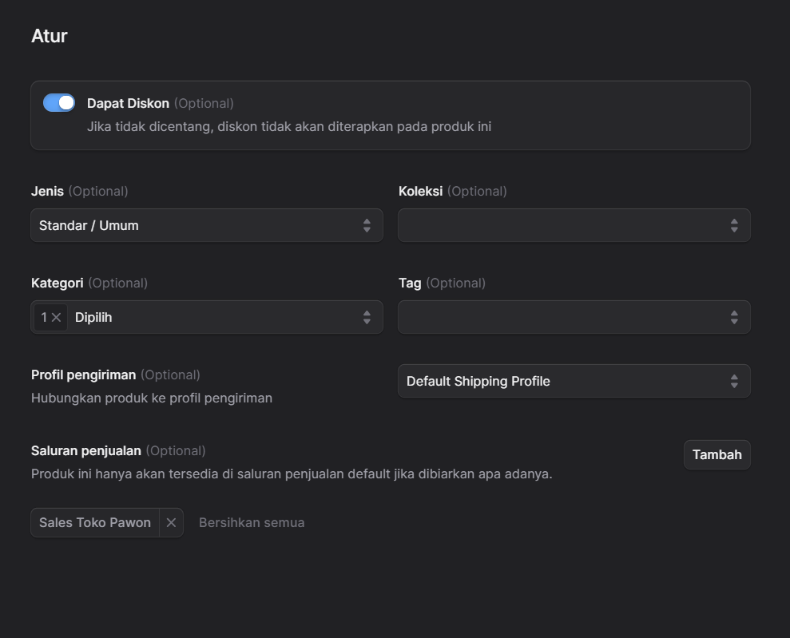
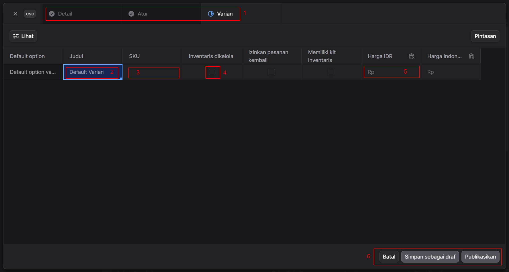
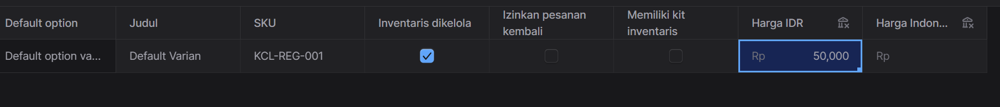

# Menambah Produk Baru

Untuk menambah item produk baru Anda bisa pergi ke [Manajemen Produk](manage.md) Link ke aplikasi admin : <a href="https://store.tokopawon.id/app/products" target="_blank">https://store.tokopawon.id/app/products</a> dan menekan tombol nomor 4 seperti gambar berikut:

 

Setelah Anda menekan tombol ini maka akan muncul form pembuatan item produk baru berikut:

 
 

### Penjelasan Elemen Antarmuka Form Step 1 (Detail)

**1. Indikator Tahapan (Progress Steps)**
Bagian ini menunjukkan posisi Anda saat ini dalam alur penambahan produk. Terdapat tiga tahapan utama:
* **Detail**: Tahap pengisian informasi dasar (sedang aktif).
* **Atur**: Tahap pengaturan lanjutan (inventaris, pengiriman, dll).
* **Varian**: Tahap untuk mengelola variasi produk jika ada.

**2. Judul Produk (Wajib)**
* **Nama Kolom:** Judul
* **Fungsi:** Digunakan untuk memasukkan nama utama produk yang akan ditampilkan kepada pelanggan.
* **Contoh Pengisian:** `Kue Cokelat Lumer`

**3. Subjudul Produk (Opsional)**
* **Nama Kolom:** Subjudul
* **Fungsi:** Digunakan untuk memberikan deskripsi singkat atau daya tarik utama produk yang melengkapi judul.
* **Contoh Pengisian:** `Manis, lembut, dan lumer di mulut`

**4. Handle URL (Opsional)**
* **Nama Kolom:** Handle
* **Fungsi:** Berfungsi sebagai *slug* atau akhiran tautan URL untuk halaman produk tersebut. Jika dikosongkan, sistem biasanya akan membuatnya secara otomatis berdasarkan Judul Produk.
* **Contoh Pengisian:** `kue-cokelat-lumer`

**5. Deskripsi Produk (Opsional)**
* **Nama Kolom:** Deskripsi
* **Fungsi:** Area teks yang lebih luas untuk mendeskripsikan produk secara mendetail, seperti komposisi bahan, cita rasa, berat bersih, alergen, atau masa simpan produk.

**6. Unggah Media (Opsional)**
* **Nama Kolom:** Media
* **Fungsi:** Area untuk mengunggah foto atau gambar produk . 
* **Cara Penggunaan:** Pengguna dapat menarik dan melepas file gambar langsung ke dalam kotak bersisi putus-putus (*drag and drop*), atau mengklik area tersebut untuk membuka penjelajah file dan memilih foto hidangan dari perangkat. Anda bisa memilih lebih dari satu file saat mengunggah foto produk.

**7. Pengaturan Varian**
* **Nama Kolom:** Varian
* **Fungsi:** Tombol alih (*toggle*) untuk menentukan apakah produk memiliki opsi pilihan (seperti ukuran porsi: Reguler, Jumbo; atau tingkat kepedasan: Sedang, Pedas, Ekstra Pedas). 
* **Catatan:** Jika tombol ini dimatikan (tidak dicentang), sistem akan secara otomatis membuat satu varian *default* untuk produk tersebut. Jika dihidupkan, Anda akan diminta mengatur detail varian pada tahap selanjutnya.

**8. Tombol Aksi (Action Buttons)**
Kumpulan tombol navigasi dan eksekusi di sudut kanan bawah untuk mengelola form saat ini:
* **Batal:** Membatalkan seluruh proses penambahan produk baru dan kembali ke halaman sebelumnya.
* **Simpan sebagai draf:** Menyimpan progres isian form saat ini ke dalam sistem dengan status *Draft* (belum dipublikasikan atau aktif).
* **Lanjutkan:** Memvalidasi isian form saat ini dan membawa pengguna ke langkah selanjutnya (Tahap "Atur").

Contoh Pengisian Form Produk :
 
 
 

##  Penambahan Data Produk Baru (Tahap 2 - Atur)

 

 

### Penjelasan Elemen Antarmuka

**1. Indikator Tahapan (Progress Steps)**
Menunjukkan posisi Anda dalam alur penambahan produk. Tanda centang pada "Detail" menandakan tahap sebelumnya telah selesai, dan saat ini Anda berada di tahap **Atur**.

**2. Pengaturan Diskon (Opsional)**
* **Nama Kolom:** Dapat Diskon
* **Fungsi:** Tombol alih (*toggle*) untuk menentukan apakah produk ini memenuhi syarat untuk mendapatkan potongan harga atau promo. Jika tidak dicentang, maka kode diskon atau promo otomatis tidak akan berlaku untuk produk ini.
* **Contoh:** Diaktifkan agar *Kue Cokelat Lumer* bisa dibeli menggunakan voucher diskon akhir pekan.

**3. Jenis Produk (Opsional)**
* **Nama Kolom:** Jenis
* **Fungsi:** Menu tarik-turun (*dropdown*) untuk menentukan klasifikasi umum produk Anda. 
* **Contoh Pilihan:** Untuk mengatur jenis produk Anda bisa pergi ke [Jenis Produk](../pengaturan/jenis-produk.md).

**4. Koleksi Produk (Opsional)**
* **Nama Kolom:** Koleksi
* **Fungsi:** Menu tarik-turun (*dropdown*) untuk memasukkan produk ke dalam kelompok koleksi tertentu di toko Anda.
* **Contoh Pilihan:** Untuk mengatur koleksi produk Anda bisa pergi ke [Koleksi Produk](koleksi.md).

**5. Kategori Sistem (Opsional)**
* **Nama Kolom:** Kategori
* **Fungsi:** Menu tarik-turun (*dropdown*) untuk menempatkan produk sesuai Kategori.Bisa lebih dari satu kategori.
* **Contoh Pilihan:** Untuk mengatur koleksi produk Anda bisa pergi ke [Kategori Produk](kategori.md).

**6. Label/Tag (Opsional)**
* **Nama Kolom:** Tag
* **Fungsi:** Menu tarik-turun atau area ketik untuk menambahkan kata kunci spesifik yang membantu pengelompokan internal dan pencarian pelanggan.
* **Contoh Pilihan:** Untuk mengatur Tag produk Anda bisa pergi ke [Tag Produk](../pengaturan/tag-produk.md).

**7. Pengaturan Pengiriman (Opsional)**
* **Nama Kolom:** Profil pengiriman
* **Fungsi:** Menu tarik-turun untuk menghubungkan produk dengan profil tarif atau metode pengiriman tertentu. Ini sangat penting untuk makanan.
* **Contoh Pilihan:** Pilih saja "Default Shipping Profile"

**8. Tambah Saluran Penjualan (Opsional)**
* **Tombol:** Tambah
* **Fungsi:** Membuka menu tambahan untuk memilih di saluran (*channel*) mana saja produk ini akan ditayangkan dan bisa dibeli. Jika dibiarkan, produk hanya akan tersedia di saluran bawaan (*default*).

**9. Daftar Saluran Penjualan Aktif**
* **Fungsi:** Area ini menampilkan *chip* atau label dari saluran penjualan yang sudah dipilih. Pada gambar, produk diatur agar tersedia di **Sales Toko Pawon**. 
* **Aksi:** Anda dapat menghapus saluran satu per satu dengan mengklik tombol "X" pada *chip*, atau menghapus seluruhnya sekaligus dengan mengklik teks **Bersihkan semua**.

**10. Tombol Aksi (Action Buttons)**
Kumpulan tombol navigasi dan eksekusi di sudut kanan bawah:
* **Batal:** Membatalkan proses dan membuang perubahan.
* **Simpan sebagai draf:** Menyimpan progres sebagai draf (belum aktif).
* **Lanjutkan:** Memvalidasi form Tahap 2 ini dan membawa pengguna ke langkah terakhir (Tahap "Varian").

Contoh Pengisian Form pembuatan produk tahap 2:
 

Berikut adalah dokumentasi langkah demi langkah untuk proses penambahan record produk baru tahap ketiga (Varian) berdasarkan tangkapan layar yang Anda berikan. Contoh pengisian tetap menggunakan konteks produk makanan seperti pada langkah sebelumnya.

##  Penambahan Data Produk Baru (Tahap 3 - Varian)

 

Halaman ini merupakan langkah terakhir dalam proses pembuatan produk baru. Pada tahap ini, pengguna mengatur detail esensial terkait identitas stok, pelacakan inventaris, dan penentuan harga jual untuk produk tersebut. 

*(Catatan: Karena pada gambar ini hanya muncul satu baris data, diasumsikan pada Tahap 1 opsi Varian tidak dicentang, sehingga sistem membuat satu "Default Varian" secara otomatis).*

### Penjelasan Elemen Antarmuka Form

**1. Indikator Tahapan (Progress Steps)**
Menunjukkan posisi Anda di akhir alur penambahan produk. Tanda centang pada "Detail" dan "Atur" menandakan kedua tahap tersebut telah selesai diisi, dan saat ini Anda sedang mengonfigurasi tahap **Varian**.

**2. Judul Varian**
* **Nama Kolom:** Judul
* **Fungsi:** Kolom teks untuk memberi nama spesifik pada varian ini. Jika produk tidak memiliki variasi lain, sistem biasanya menamainya "Default Varian", namun Anda bisa mengubahnya agar lebih informatif.
* **Contoh Pengisian:** `Ukuran Reguler` atau `Loyang 20cm` (untuk produk Kue Cokelat Lumer).

**3. SKU (Stock Keeping Unit)**
* **Nama Kolom:** SKU
* **Fungsi:** Kolom untuk memasukkan kode identifikasi unik yang digunakan secara internal oleh toko untuk melacak inventaris dan mengelola stok.
* **Contoh Pengisian:** `KCL-REG-001` (Singkatan dari: Kue Cokelat Lumer - Reguler - Batch 001).

**4. Pengelolaan Inventaris**
* **Nama Kolom:** Inventaris dikelola
* **Fungsi:** Kotak centang (*checkbox*) untuk mengaktifkan fitur pelacakan stok otomatis. 
* **Contoh Penggunaan:** Jika dicentang, sistem akan mencatat jumlah stok (misalnya: 20 porsi kue) dan secara otomatis menguranginya setiap kali ada pesanan masuk, guna mencegah pesanan berlebih (*overselling*) saat kue sudah habis.

**5. Harga Jual**
* **Nama Kolom:** Harga IDR
* **Fungsi:** Kolom numerik untuk memasukkan harga jual dasar produk tersebut dalam mata uang Rupiah (IDR).
* **Contoh Pengisian:** `50000` (Harga kue, biasanya diinput hanya berupa angka tanpa titik pemisah ribuan).

**6. Tombol Aksi Akhir (Final Action Buttons)**
Kumpulan tombol navigasi dan penyelesaian di sudut kanan bawah:
* **Batal:** Membatalkan seluruh proses pembuatan produk dari awal dan tidak menyimpan data apa pun.
* **Simpan sebagai draf:** Menyimpan seluruh data dari Tahap 1, 2, dan 3 ke dalam sistem dengan status *Draft* (belum tayang di toko, bisa diedit kembali).
* **Publikasikan:** Mengeksekusi penyimpanan data secara final dan langsung mengaktifkan produk tersebut sehingga dapat dilihat dan dibeli oleh pelanggan di saluran penjualan Anda.
 
Contoh isian form produk tahap 3:
 

Untuk saat ini beginilah cara penambahan record produk yang valid