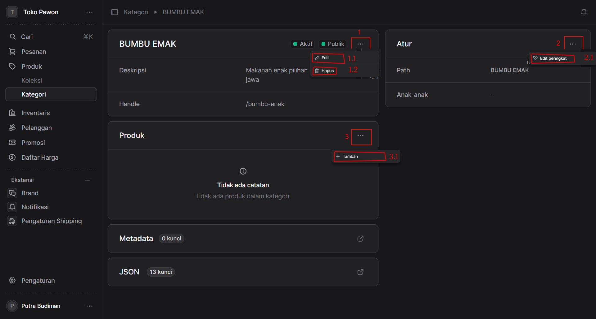
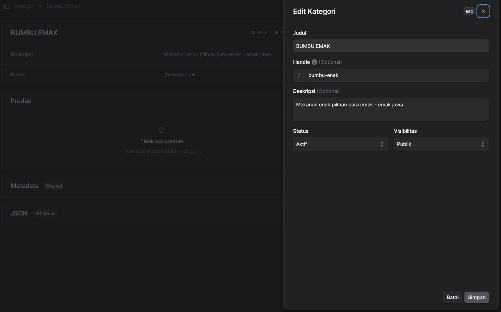
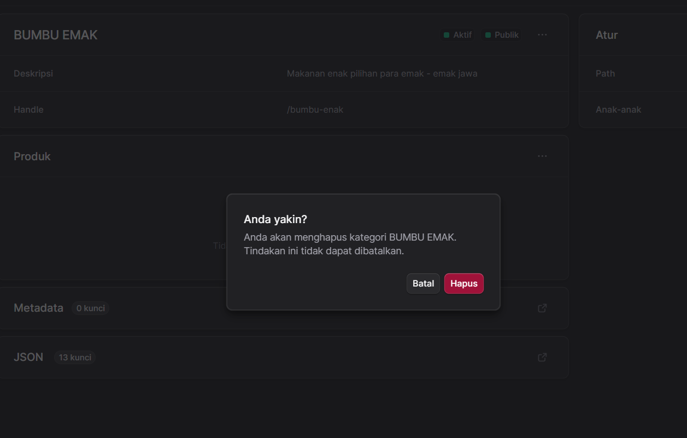
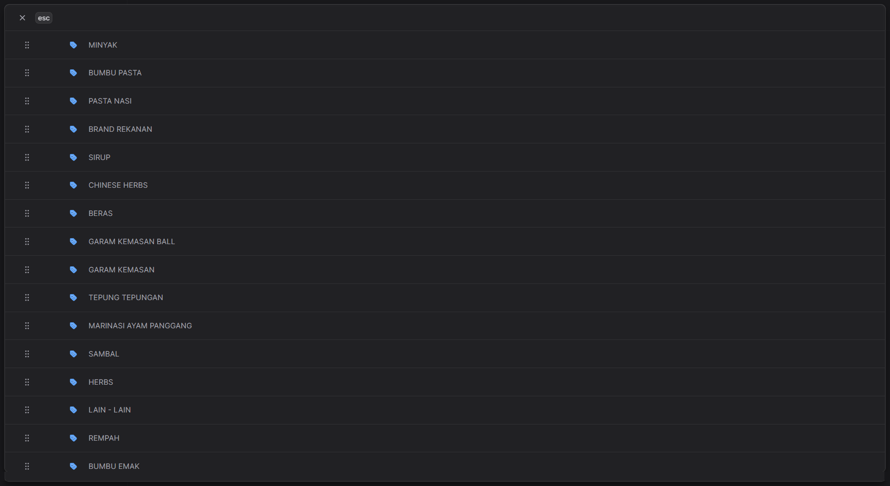
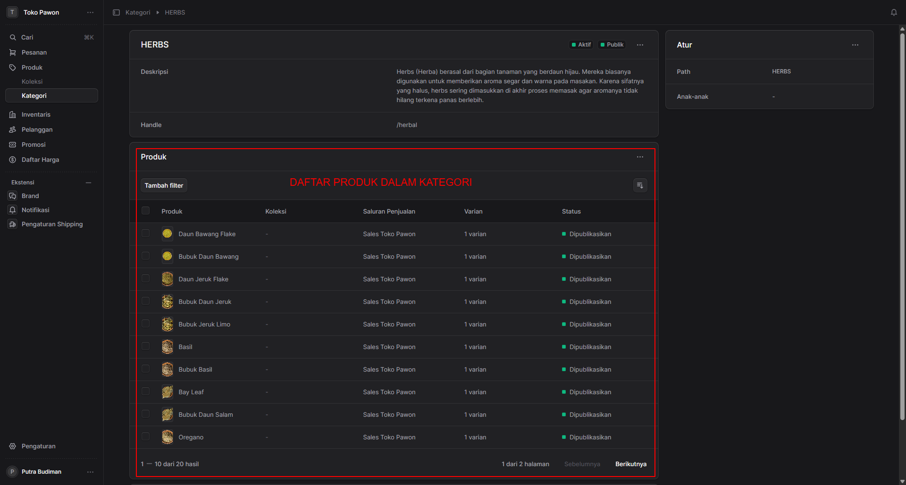
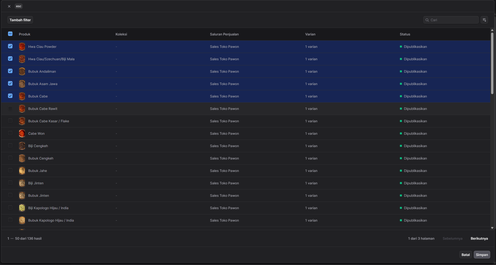

Dokumentasi ini disusun untuk menjelaskan setiap komponen dan aksi yang ditandai dengan angka merah pada gambar.

### Gambaran Umum **Halaman Detail Kategori** 
Halaman ini digunakan untuk melihat detail, mengelola informasi, dan mengatur produk yang terhubung ke dalam sebuah kategori spesifik (dalam contoh ini adalah kategori **BUMBU EMAK**).

---

### Anatomi Halaman & Fungsi Aksi

#### 1. Kartu Informasi Utama Kategori (Bagian Kiri Atas)
Bagian ini menampilkan informasi dasar kategori, termasuk Nama Kategori (BUMBU EMAK), Status visibilitas (Aktif, Publik), Deskripsi, dan URL *Handle* (`/bumbu-enak`).

Pada sudut kanan atas kartu ini terdapat tombol opsi (titik tiga) yang ditandai dengan **Angka 1**, berisi menu tindakan berikut:
* **1.1 Edit:** Tombol ini berfungsi untuk membuka formulir penyuntingan. Pengguna dapat mengubah nama, deskripsi, *handle*, atau status kategori.

* **1.2 Hapus:** Tombol ini berfungsi untuk menghapus kategori secara permanen dari sistem. Biasanya akan muncul peringatan konfirmasi sebelum penghapusan benar-benar dilakukan.

#### 2. Kartu "Atur" / Hierarki Kategori (Bagian Kanan Atas)
Bagian ini menunjukkan struktur kategori dalam toko, meliputi *Path* (jalur kategori) dan *Anak-anak* (sub-kategori yang berada di bawahnya). 

Pada sudut kanan atas kartu ini terdapat tombol opsi (titik tiga) yang ditandai dengan **Angka 2**, berisi menu tindakan berikut:
* **2.1 Edit peringkat:** Berfungsi untuk mengubah urutan (ranking/posisi) tampilan kategori ini relatif terhadap kategori lainnya, baik di halaman etalase toko maupun di dalam hierarki navigasi.

#### 3. Kartu "Produk" (Bagian Tengah)
Bagian ini adalah area daftar produk yang tergabung di dalam kategori "BUMBU EMAK". Pada gambar, terlihat informasi "Tidak ada catatan", yang berarti belum ada produk yang dihubungkan ke kategori ini.

Jika Anda sudah memasukkan produk kedalam kategori maka akan tampil seperti ini:

Pada sudut kanan atas kartu ini terdapat tombol opsi (titik tiga) yang ditandai dengan **Angka 3**, berisi menu tindakan berikut:
* **3.1 Tambah:** Berfungsi untuk menambahkan atau menautkan produk ke dalam kategori ini. Pengguna biasanya akan diarahkan untuk memilih produk dari inventaris yang sudah ada untuk dimasukkan ke grup BUMBU EMAK.

Setelah Anda menekan tombol tambah maka akan muncul form ceklist daftar produk seperti ini:

 

Klik Simpan untuk menyimpan perubahan.