## Melihat dan Mengubah Detail Produk

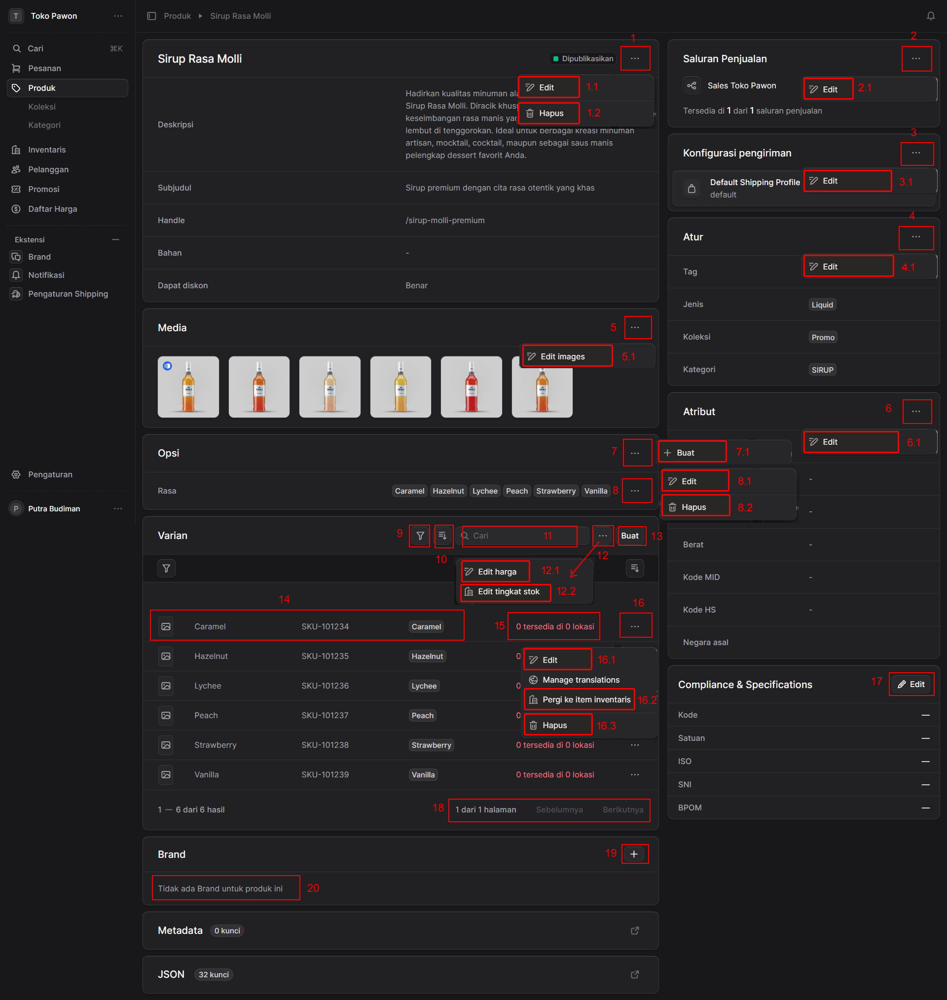

### **1. Informasi Utama Produk (Kiri Atas)**
Bagian ini menampilkan informasi dasar produk seperti Nama Produk (Sirup Rasa Molli), Status Publikasi, Deskripsi, Subjudul, Handle (URL), dan status diskon.

* **1 - Menu Opsi (Titik Tiga):** Membuka menu *dropdown* untuk tindakan pada produk utama.
    * **1.1 - Edit:** Klik untuk mengubah informasi dasar produk (nama, deskripsi, subjudul, dll).

    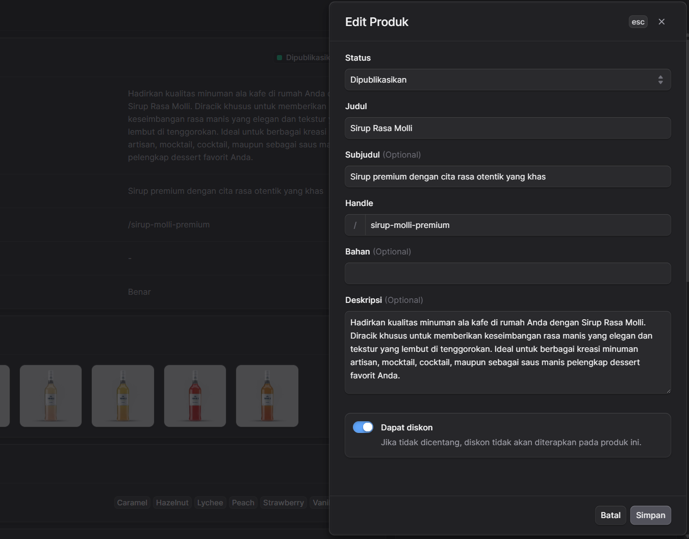

    * **1.2 - Hapus:** Klik untuk menghapus produk ini secara permanen dari sistem.

    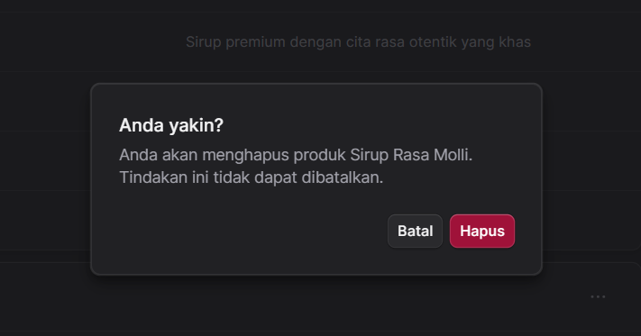

### **2. Saluran Penjualan (Kanan Atas)**
Mengatur di mana saja produk ini dapat dibeli oleh pelanggan.

* **2 - Menu Opsi Saluran Penjualan:** Membuka menu tindakan terkait *Sales Channel*.
    * **2.1 - Edit:** Klik untuk mengelola ketersediaan produk di saluran penjualan yang terhubung (misal: Sales Toko Pawon).

    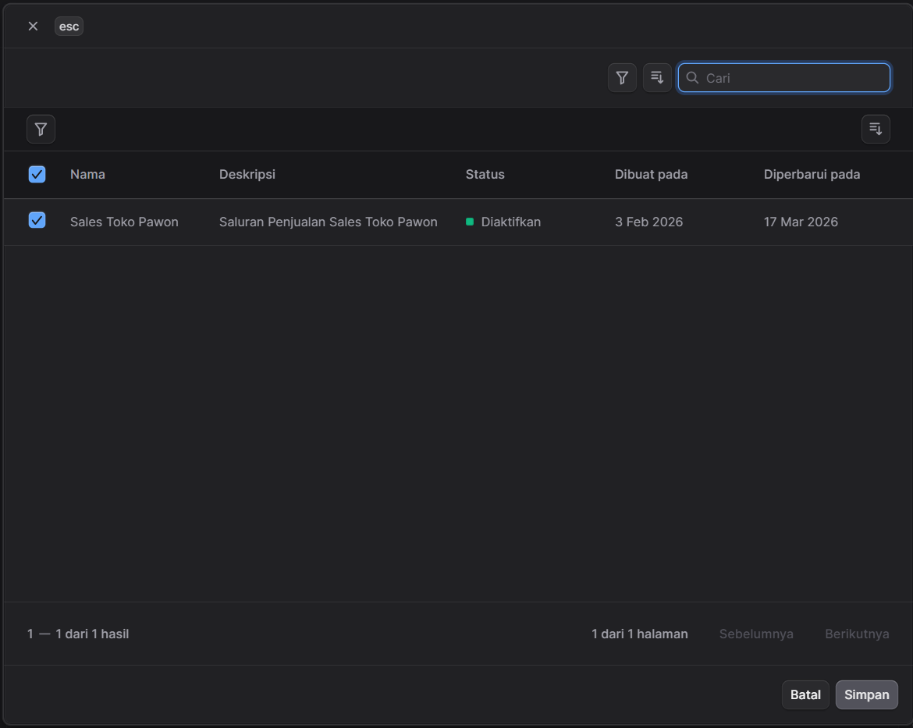

### **3. Konfigurasi Pengiriman (Kanan)**
Mengatur profil ongkos kirim dan metode pengiriman untuk produk ini.

* **3 - Menu Opsi Pengiriman:** Membuka menu tindakan terkait pengiriman.
    * **3.1 - Edit:** Klik untuk mengubah atau memilih *Shipping Profile* (Profil Pengiriman) yang berlaku untuk produk ini.

    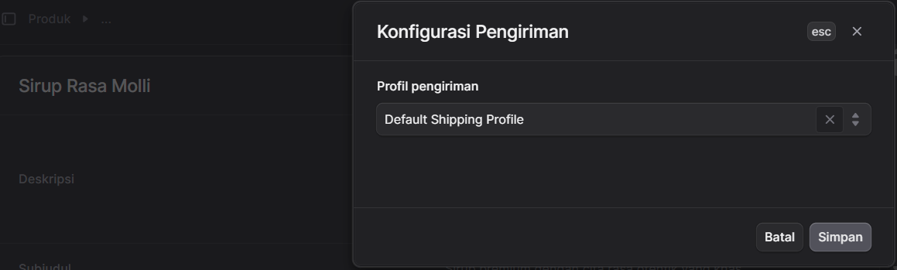

### **4. Atur (Organize - Kanan)**
Bagian untuk mengkategorikan produk agar mudah dicari oleh pelanggan dan dikelola oleh admin.

* **4 - Menu Opsi Atur:** Membuka menu tindakan terkait pengelompokan.
    * **4.1 - Edit:** Klik untuk menambah atau mengubah Tag, Jenis produk, Koleksi, dan Kategori produk (contoh: Kategori "SIRUP").

    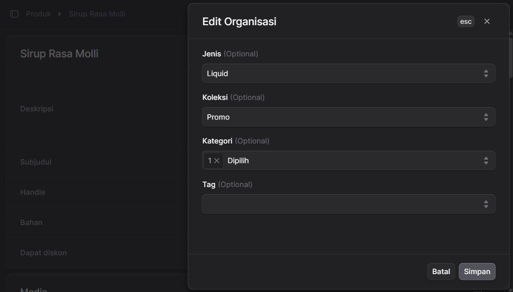

### **5. Media (Kiri Tengah)**
Bagian untuk mengelola aset visual produk.

* **5 - Menu Opsi Media:** Membuka menu tindakan untuk galeri produk.
    * **5.1 - Edit images:** Klik untuk menambahkan foto baru, menghapus foto, atau mengatur urutan gambar yang ditampilkan.

    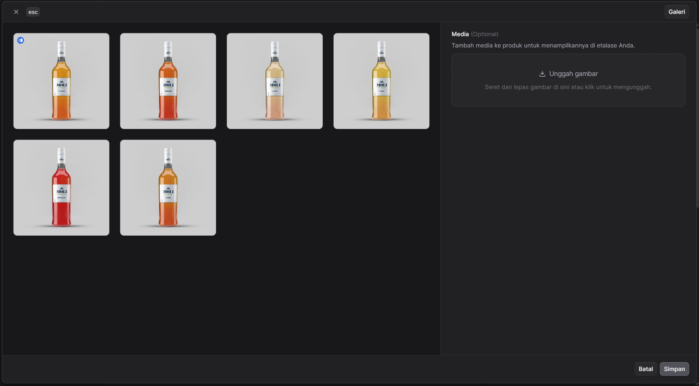

### **6. Atribut (Kanan Tengah)**
Mengatur data spesifik produk terkait logistik dan identifikasi internasional.

* **6 - Menu Opsi Atribut:** Membuka menu tindakan atribut.
    * **6.1 - Edit:** Klik untuk memasukkan data seperti Berat, Kode MID, Kode HS, dan Negara asal produk.

    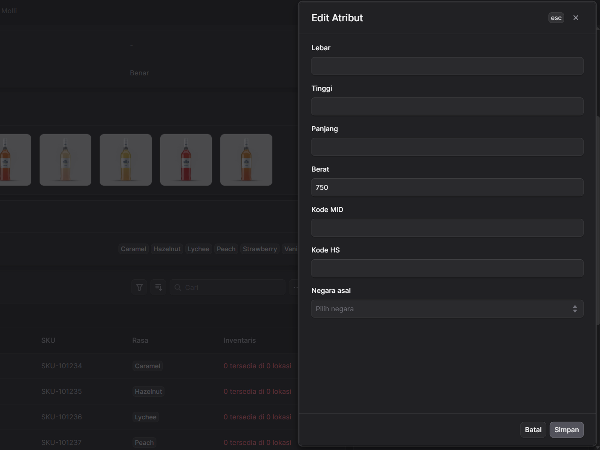

### **7. Opsi Produk (Kiri Tengah)**
Digunakan untuk mengubah opsi varian produk contoh disini menampilkan opsi varian yang sudah kita input sebelumnya, seperti Rasa, Ukuran, atau Warna. Pada gambar, opsinya adalah "Rasa".

* **7 - Menu Tindakan Opsi Utama:**
    * **7.1 - Buat:** Menambahkan tipe opsi baru (misal: menambahkan "Netto" selain "Rasa" (**opsi yang sudah ada**)).

    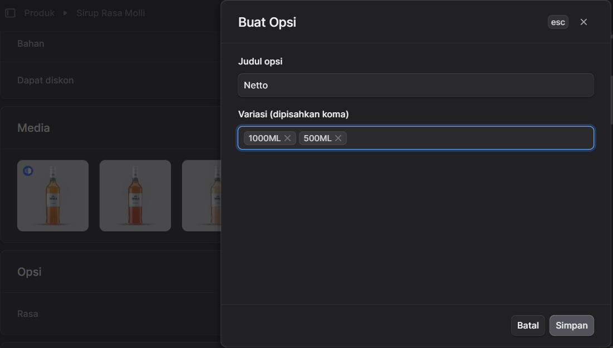

* **8 - Menu Tindakan Opsi Spesifik (misal "Rasa"):**
    * **8.1 - Edit:** Mengubah nama opsi atau menambah/mengurangi daftar rasa (Caramel, Hazelnut, dll).

    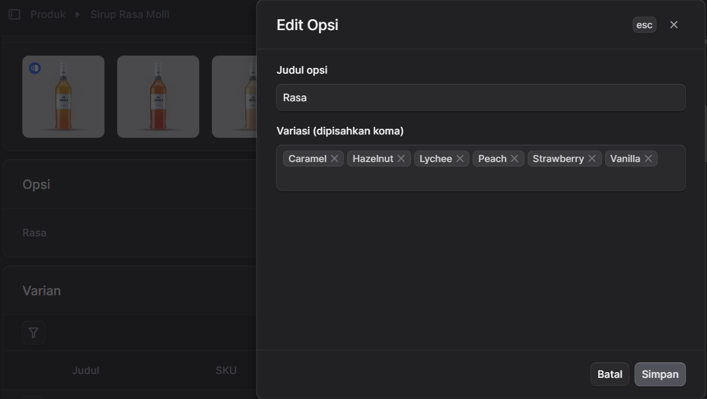

    * **8.2 - Hapus:** Menghapus seluruh opsi "Rasa" beserta variannya.

    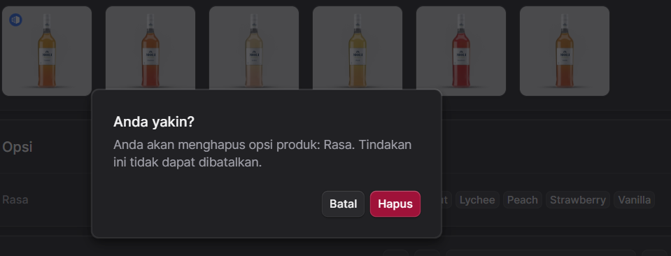

### **8. Daftar Varian Produk (Kiri Bawah)**
Daftar Varian produk yang sudah kita buat berdasarkan opsi varian yang sudah kita buat sebelumnya, beserta nilai masing-masing opsi varian .

* **Alat Pencarian & Filter:**
    * **9 - Filter:** Menyaring daftar varian berdasarkan kriteria tertentu.
    * **10 - Pengaturan Kolom:** Menyesuaikan kolom apa saja yang ingin ditampilkan di tabel varian.
    * **11 - Kolom Pencarian:** Mencari varian spesifik berdasarkan nama atau SKU.
* **Aksi Global Varian:**
    * **12 - Menu Opsi Massal:** Membuka tindakan yang bisa diterapkan ke beberapa varian sekaligus.
        * **12.1 - Edit Harga:** Mengubah harga semua varian.
        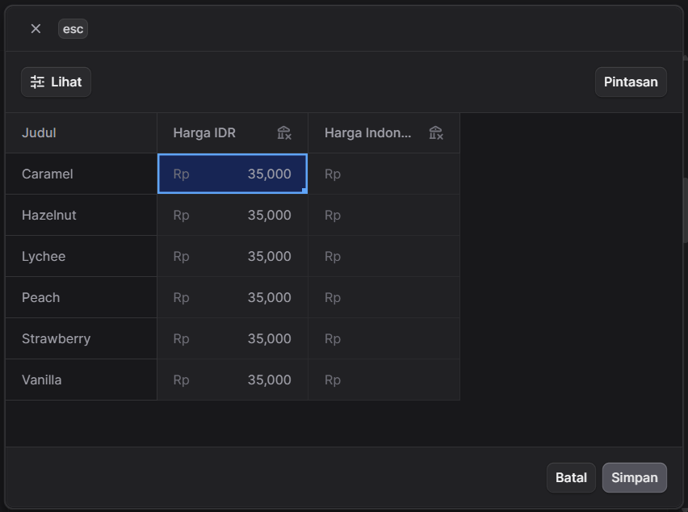
    * **13 - Edit Stock Bertingkat:** Mengubah stock bertingkat semua varian.
        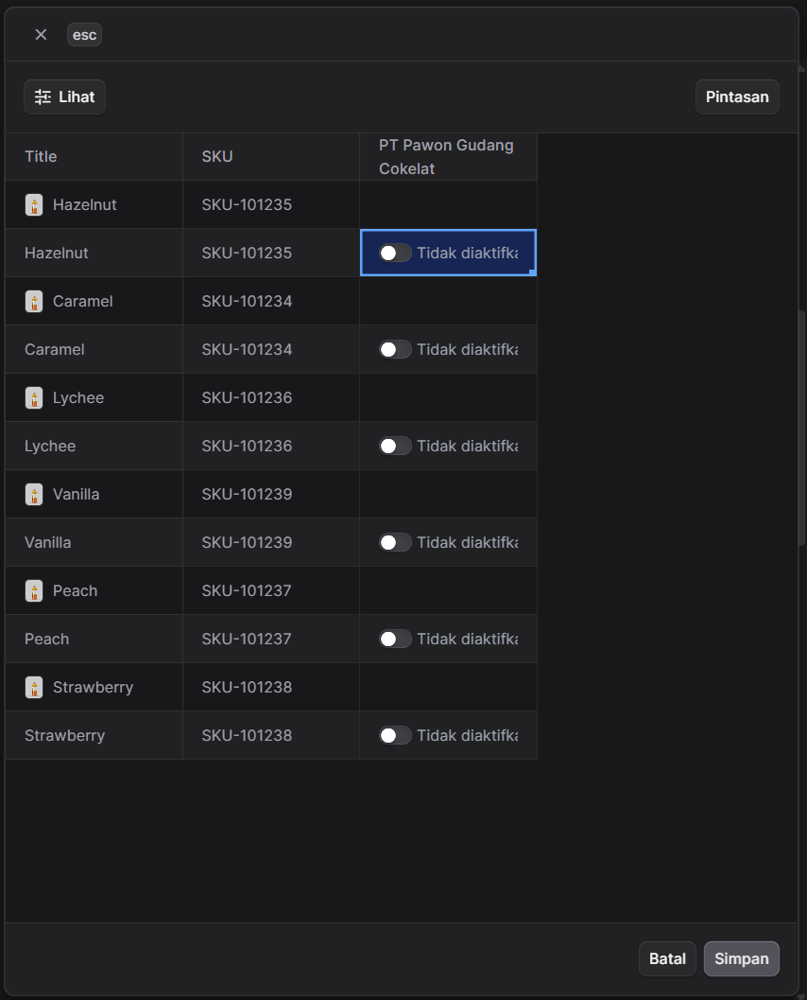

        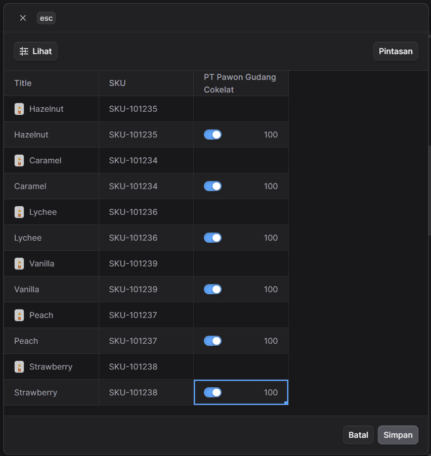

        Tindakan akan mengupdate jumlah ketersediaan stok untuk semua varian produk.

* **Tabel Data Varian:**
    * **14 - Informasi Varian:** Menampilkan gambar varian, Nama Varian (contoh: Caramel), SKU produk, dan nilai opsinya.
    * **15 - Status Inventaris:** Menampilkan jumlah stok produk dan ketersediaan lokasi.
* **Aksi Baris Varian:**
    * **16 - Menu Opsi Varian Individual:** Membuka tindakan khusus untuk satu baris varian.
        * **16.1 - Edit:** Mengubah detail spesifik varian (harga khusus varian, barcode, dll).
        * **16.2 - Pergi ke item inventaris:** Membuka halaman manajemen stok untuk menyesuaikan jumlah barang fisik varian tersebut.
        * **16.3 - Hapus:** Menghapus varian spesifik dari daftar.
* **Navigasi:**
    * **18 - Pagination:** Berpindah antar halaman jika daftar varian melebihi batas tampilan satu halaman (contoh: "1 dari 1 halaman").

### **9. Compliance & Specifications (Kanan Bawah)**
Bagian untuk mengisi spesifikasi produk.

* **17 - Edit:** Klik untuk mengisi informasi spesifikasi produk seperti Kode, Satuan, ISO, SNI, dan BPOM jika ada.

    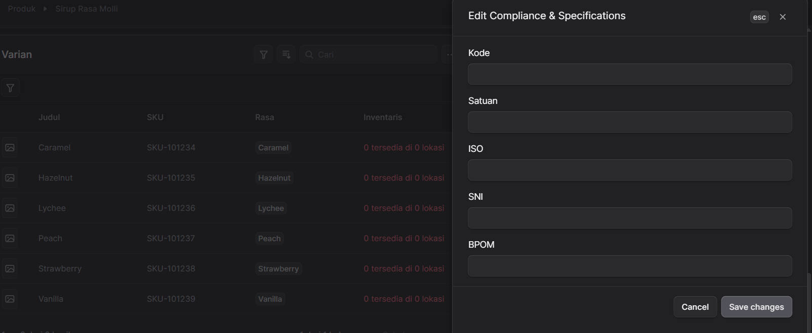

### **10. Brand (Kiri Paling Bawah)**
Digunakan untuk menautkan produk ke merek tertentu di dalam sistem.

* **19 - Tombol Tambah (+):** Klik untuk memilih atau menambahkan entitas Brand pada produk ini.

    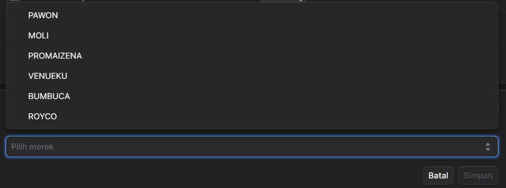

* **20 - Status Brand:** Menunjukkan bahwa saat ini belum ada brand yang ditautkan ke produk (*"Tidak ada Brand untuk produk ini"*).

    Jika sudah ada brand yang ditautkan ke produk maka akan muncul seperti ini:

    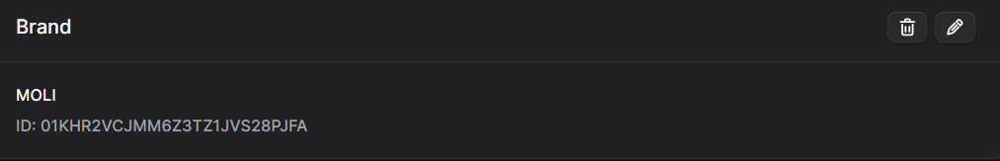

    Tombol pensil digunakan untuk mengedit brand yang sudah ditautkan ke produk. dan tombol tong sampah digunakan untuk menghapus brand yang sudah ditautkan ke produk.