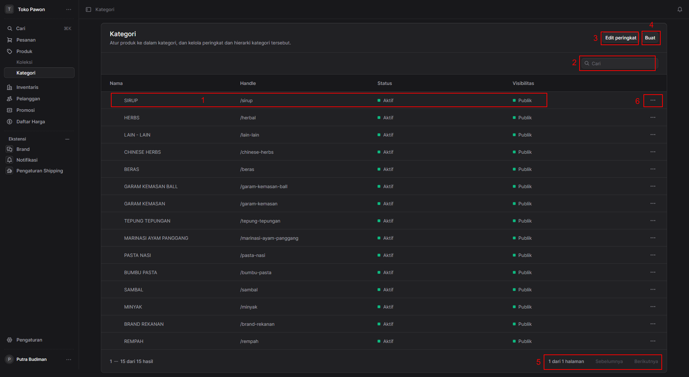
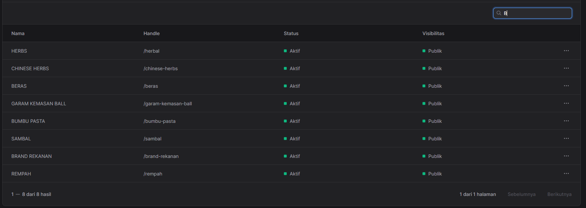
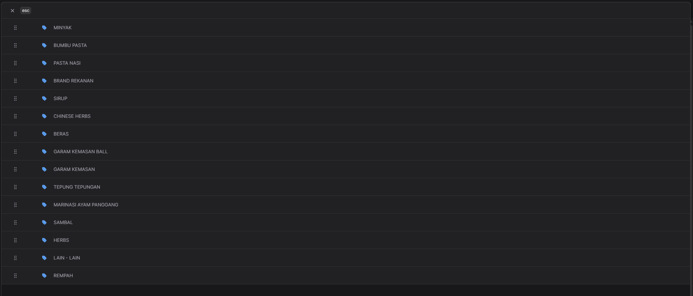
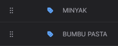
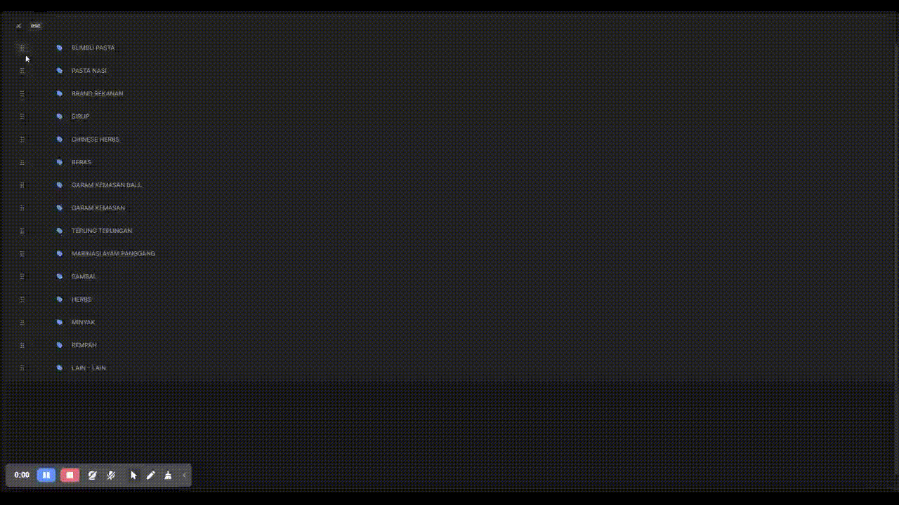

# Manajemen Kategori Produk

 

##  Manajemen Kategori Produk

Halaman **Kategori** digunakan untuk mengatur produk ke dalam kelompok tertentu, serta mengelola peringkat (urutan) dan hierarki dari kategori-kategori tersebut. Antarmuka ini memberikan gambaran umum mengenai semua kategori yang terdaftar di dalam sistem.

Berikut adalah penjelasan fungsi dari masing-masing elemen yang ditandai dengan angka pada gambar:

* **1. Baris Data Kategori (Informasi Utama)**
    Area ini menampilkan daftar kategori yang sudah ada beserta atribut utamanya. Anda dapat melihat empat kolom informasi:
    * **Nama:** Nama dari kategori (contoh: SIRUP, HERBS).
    * **Handle:** *Slug* atau path URL yang digunakan untuk kategori tersebut pada sistem/situs web (contoh: `/sirup`).
    * **Status:** Menunjukkan status keaktifan kategori saat ini (contoh: indikator hijau "Aktif").
    * **Visibilitas:** Menunjukkan siapa saja yang bisa melihat kategori ini (contoh: "Publik").
    *Catatan: Mengklik salah satu baris ini umumnya akan membawa Anda ke halaman detail untuk melihat atau mengubah informasi spesifik dari kategori tersebut.*

* **2. Kolom Pencarian (Cari)**
    Fungsi ini memudahkan Anda untuk menemukan kategori tertentu dengan cepat. Anda cukup mengetikkan nama kategori atau kata kunci yang relevan di dalam kotak teks, dan sistem akan menyaring daftar di bawahnya sesuai dengan kata kunci tersebut.

    Contoh daftar kategori yang di filter berdasar pencarian dengan huruf "B":
    

* **3. Tombol "Edit peringkat"**
    Tombol ini digunakan ketika Anda perlu mengatur ulang urutan tampilan kategori. Fitur ini sangat berguna untuk menentukan kategori mana yang harus diprioritaskan atau ditampilkan lebih dulu di halaman depan toko atau menu navigasi.

    

    Untuk melakukan pengurutan, silahkan klik dan tahan pada ikon titik enam pada baris kategori yang ingin diurutkan, lalu seret ke posisi yang diinginkan.
    
    
    

* **4. Tombol "Buat"**
    Klik tombol ini untuk menambahkan kategori produk baru ke dalam sistem. Biasanya, tombol ini akan membuka halaman formulir baru di mana Anda bisa mengisi Nama, Handle, Status, Visibilitas, dan menambahkan produk ke dalamnya.

    

* **5. Navigasi Halaman (Paginasi)**
    Fitur ini berada di sudut kanan bawah dan berfungsi untuk navigasi jika jumlah kategori melebihi batas tampilan dalam satu halaman. 
    * Menampilkan jumlah baris saat ini (contoh: 1–15 dari 15 hasil).
    * Menampilkan posisi halaman (contoh: 1 dari 1 halaman).
    * Tombol **Sebelumnya** dan **Berikutnya** digunakan untuk berpindah ke halaman daftar kategori yang lain.

* **6. Menu Tindakan (Ikon Tiga Titik)**
    Ini adalah menu *dropdown* untuk tindakan cepat. Dengan mengklik ikon tiga titik ini pada baris kategori tertentu, Anda dapat langsung melakukan tindakan spesifik pada kategori tersebut, seperti **Edit**, **Hapus**, atau **Duplikat**, tanpa perlu membuka halaman detailnya terlebih dahulu.

---
*Semoga dokumentasi ini membantu Anda dan tim dalam memahami penggunaan halaman Kategori dengan lebih baik.*