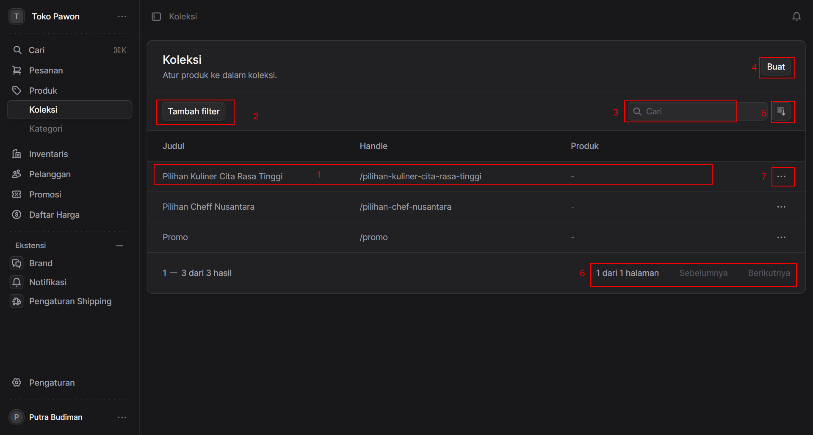
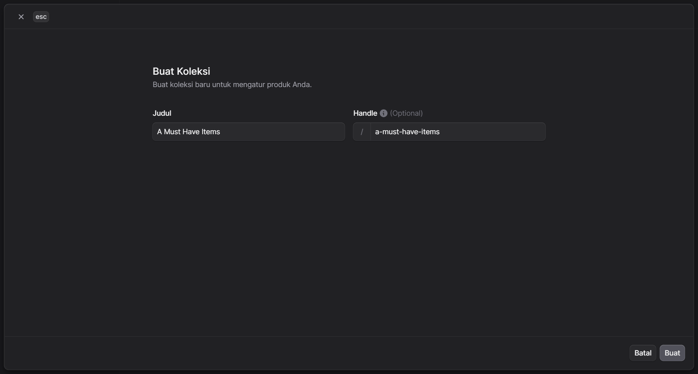
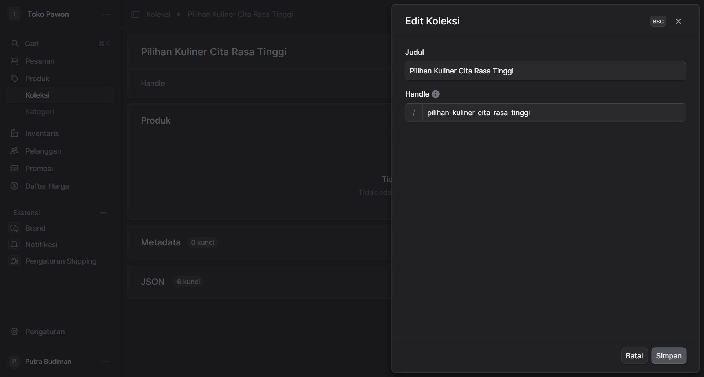
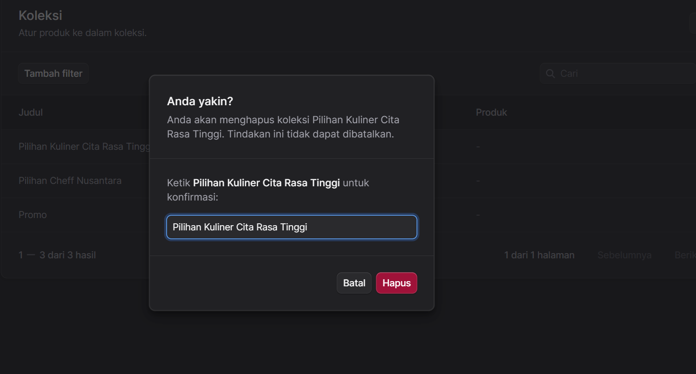

# Koleksi Produk

 

## **Manajemen Koleksi Produk**

Link ke aplikasi admin : <a href="https://store.pawon.cloud/app/collections" target="_blank">https://store.pawon.cloud/app/collections</a>

Halaman ini digunakan untuk mengatur dan mengelompokkan produk ke dalam berbagai koleksi (kategori khusus). Berikut adalah penjelasan fungsi dari setiap elemen yang ditandai dengan angka pada layar:

* **[1] Baris Data Koleksi**
    Area ini menampilkan daftar koleksi yang sudah dibuat. Setiap baris memberikan informasi ringkas yang mencakup:
    * **Judul:** Nama dari koleksi (contoh: "Pilihan Kuliner Cita Rasa Tinggi").
    * **Handle:** Tautan atau *URL slug* yang mengarah ke halaman koleksi tersebut (contoh: `/pilihan-kuliner-cita-rasa-tinggi`).
    * **Produk:** Menampilkan jumlah produk yang tergabung di dalam koleksi tersebut. Anda dapat mengklik baris ini untuk melihat detail atau mengubah isi koleksi.

* **[2] Tambah Filter**
    Tombol ini digunakan untuk memunculkan opsi penyaringan lanjutan. Anda dapat menyaring daftar koleksi berdasarkan kriteria tertentu untuk mempermudah pencarian data dalam jumlah besar.

* **[3] Kolom Pencarian (Cari)**
    Gunakan kolom teks ini untuk mencari koleksi secara cepat. Anda cukup mengetikkan kata kunci dari "Judul" atau "Handle" koleksi yang ingin dicari.

* **[4] Tombol "Buat"**
    Ini adalah tombol utama untuk menambahkan data baru. Klik tombol ini untuk membuat dan mengatur koleksi produk yang baru.

    
    Untuk membuat koleksi baru silahkan tentukan judul koleksi kemudian klik tombol "Buat".
    

* **[5] Tombol Pengurutan (Sortir)**
    Ikon ini berfungsi untuk mengatur urutan tampilan daftar koleksi pada tabel. Anda biasanya dapat mengurutkan data berdasarkan abjad (A-Z/Z-A), tanggal pembuatan, atau kriteria lainnya.

* **[6] Navigasi Halaman (Paginasi)**
    Bagian ini menunjukkan informasi halaman yang sedang Anda lihat (contoh: "1 dari 1 halaman"). Terdapat juga tombol **Sebelumnya** dan **Berikutnya** untuk berpindah antar halaman jika daftar koleksi yang Anda miliki melebihi kapasitas tampilan satu layar.

* **[7] Menu Aksi (Ikon Titik Tiga)**
    Mengklik tombol ini akan membuka menu tarik-turun (*dropdown*) yang berisi tindakan-tindakan spesifik untuk koleksi pada baris tersebut. Opsi yang umumnya tersedia di menu ini antara lain adalah **Edit**,  atau **Hapus** koleksi.

    Untuk mengedit koleksi, silahkan klik tombol "Edit" pada menu aksi.
    

    Untuk menghapus koleksi, silahkan klik tombol "Hapus" pada menu aksi.

    

    Sebelum menekan tombol "Hapus" merah Anda akan diminta memasukkan lagi Judul koleksi yang ingin Anda hapus sebagai konfirmasi.

