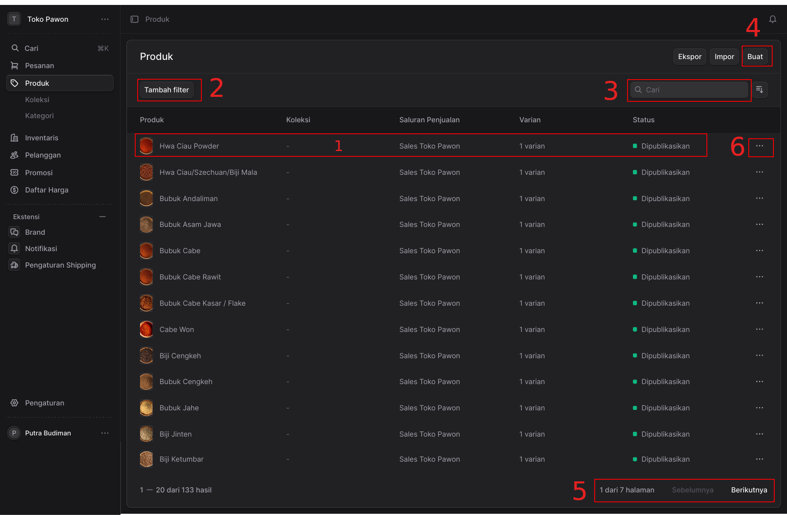
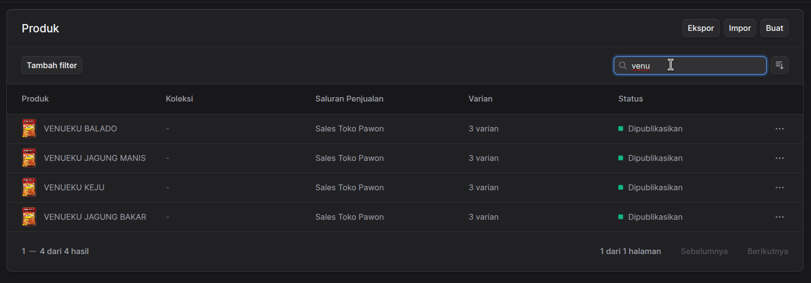

## Dokumentasi Antarmuka Halaman Manajemen Produk

Berikut adalah penjelasan mengenai fungsi-fungsi pada halaman **Produk** berdasarkan nomor yang ditandai pada gambar antarmuka sistem manajemen toko Anda:

**1. Baris Data Produk (Daftar Produk)**
Bagian ini menampilkan daftar produk yang ada di toko Anda dalam format tabel. Setiap baris mewakili satu produk dan menampilkan informasi ringkas seperti ikon/foto produk, Nama Produk, Koleksi, Saluran Penjualan, jumlah Varian, dan Status (misalnya: "Dipublikasikan"). Mengklik area baris ini biasanya akan mengarahkan Anda ke halaman detail untuk mengedit produk tersebut.

**2. Tombol "Tambah filter"**
Fungsi ini digunakan untuk menyaring daftar produk yang ditampilkan berdasarkan kriteria spesifik. Ini sangat berguna jika Anda memiliki banyak produk dan hanya ingin melihat produk dengan status tertentu (misal: draf), dari kategori tertentu, atau parameter lainnya.

**3. Kolom Pencarian Cepat**
Kotak pencarian ini memungkinkan Anda mencari produk tertentu dengan cepat di dalam daftar. Anda cukup mengetikkan nama produk atau kata kunci yang relevan, dan sistem akan menampilkan produk yang sesuai dengan pencarian Anda.

 

 Contoh kita ingin menyaring produk dengan kata kunci "Venu", maka daftar produk hanya akan menampilkan produk yang cocok dengan kata kunci yang dicari.

**4. Tombol "Buat" (Tambah Produk)**
Terletak di sudut kanan atas, tombol utama ini digunakan untuk membuat atau menambahkan entri produk baru ke dalam katalog toko (katalog inventaris) Anda.

**5. Navigasi Halaman (Paginasi)**
Karena jumlah produk seringkali terlalu banyak untuk ditampilkan dalam satu layar (dalam gambar tertulis "1 — 20 dari 133 hasil"), fitur ini digunakan untuk berpindah halaman. Anda dapat melihat informasi posisi halaman saat ini ("1 dari 7 halaman") dan menggunakan tombol **"Sebelumnya"** atau **"Berikutnya"** untuk melihat daftar produk lainnya.

**6. Menu Tindakan / Aksi Cepat (Ikon Tiga Titik)**
Ikon tiga titik horizontal ini (opsi tindakan) terletak di bagian paling kanan pada setiap baris produk. Mengklik ikon ini akan memunculkan menu *drop-down* kecil yang berisi opsi tindakan cepat khusus untuk produk di baris tersebut, seperti melihat detail, mengedit, menduplikasi, atau menghapus produk.