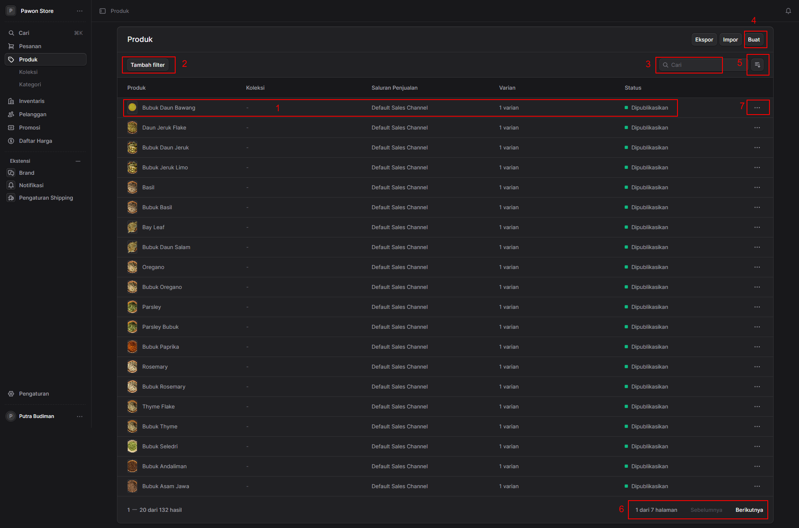
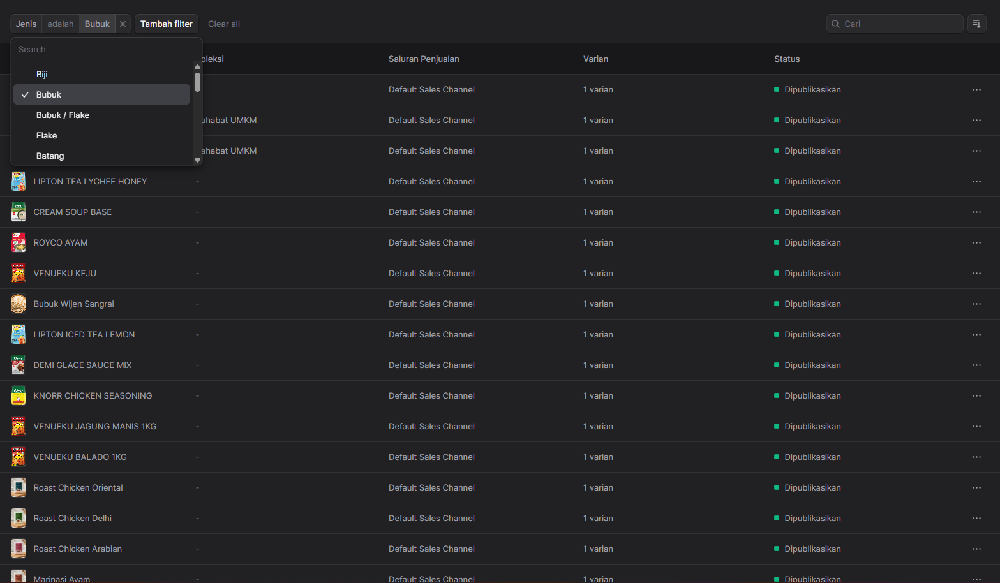
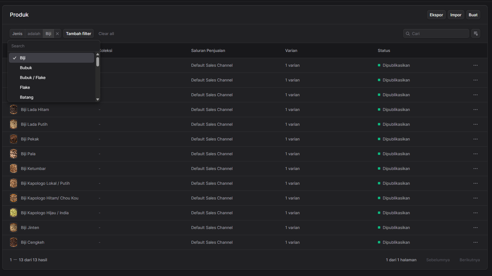
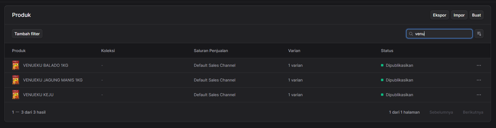
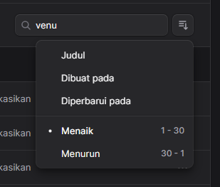
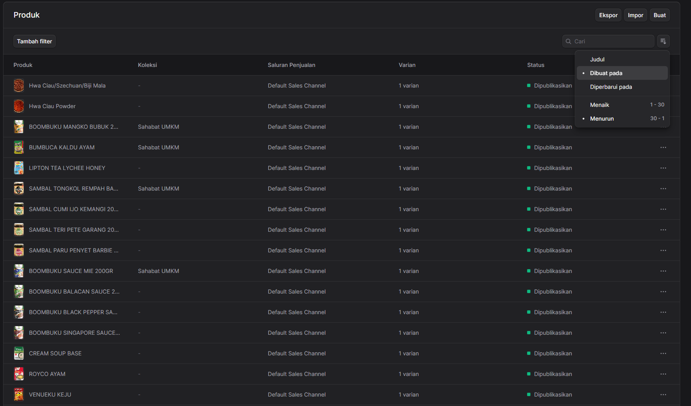
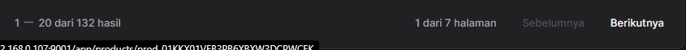
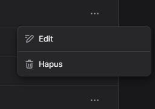
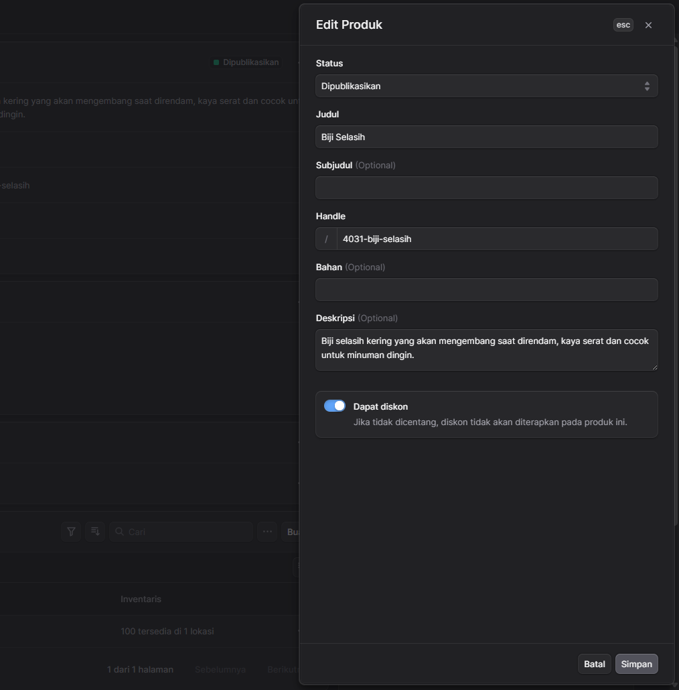
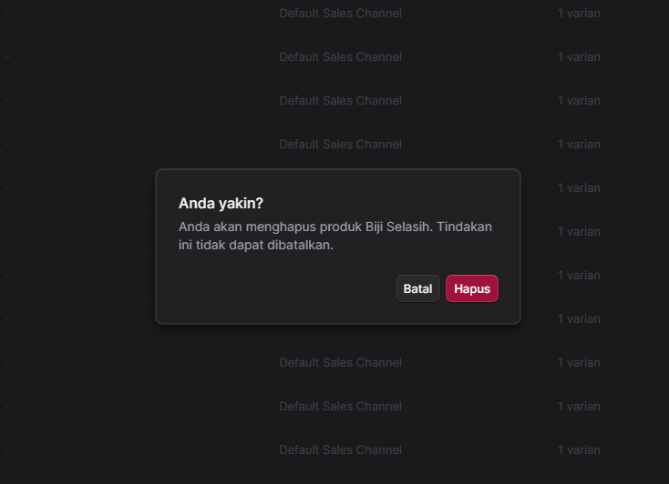

 

##  Halaman Manajemen Produk

Halaman **Produk** digunakan untuk mengelola seluruh daftar barang atau SKU yang terdaftar di sistem toko Anda. Melalui halaman ini, Anda dapat menambah produk baru, melakukan pencarian, menyaring daftar, hingga mengelola status produk.

Link ke aplikasi admin : <a href="https://store.tokopawon.id/app/products" target="_blank">https://store.tokopawon.id/app/products</a>

Berikut adalah penjelasan fungsi untuk masing-masing area yang ditandai dengan angka pada antarmuka:

* **1. Baris Informasi Produk (Tabel Produk)**
    Menampilkan daftar produk beserta detail ringkasnya dalam bentuk tabel. Informasi yang ditampilkan mencakup:
    * **Produk**: Nama atau jenis barang (contoh: Bubuk Daun Bawang).
    * **Koleksi**: Kategori atau pengelompokan produk.
    * **Saluran Penjualan**: Platform tempat produk dijual (contoh: *Default Sales Channel*).
    * **Varian**: Jumlah tipe atau ukuran yang tersedia untuk produk tersebut.
    * **Status**: Kondisi produk saat ini (contoh: Dipublikasikan, Draf).
    > *Catatan: Mengklik pada baris produk ini akan mengarahkan Anda ke halaman detail produk untuk pengeditan lebih lanjut.*
    Lihat juga : [Detail Produk](detail-produk.md)

* **2. Tambah Filter**
    Tombol ini berfungsi untuk menyaring atau memfilter daftar produk yang tampil berdasarkan kriteria spesifik, seperti status publikasi, koleksi tertentu, atau tipe produk. Fitur ini sangat berguna jika Anda memiliki ribuan produk dan ingin menampilkan kelompok tertentu saja.
    
    Contoh daftar produk yang difilter berdasarkan jenis "Bubuk":

    
    
    Contoh daftar produk yang difilter berdasarkan jenis "Biji":
    

* **3. Kolom Pencarian (Cari)**
    Gunakan kolom teks ini untuk mencari produk secara spesifik dan cepat. Anda dapat mengetikkan kata kunci seperti nama produk, SKU, atau varian untuk memunculkan produk yang dicari pada tabel.

* **4. Tombol "Buat" (Tambah Produk Baru)**
    Klik tombol **Buat** untuk menambahkan item atau produk baru ke dalam katalog toko Anda. Untuk Pembuatan Produk, silahkan klik link berikut  [Membuat Produk](/toko-pawon/v1/admin/produk/add/)
 

* **5. Tombol Pengurutan (Sort/View Options)**

    Klik ikon ini untuk membuka menu pilihan urutan. Anda dapat menentukan parameter urutan berdasarkan dua kategori utama:
    
    

    **A. Parameter Utama:**
    * **Judul**: Mengurutkan produk berdasarkan nama atau alfabet.
    * **Dibuat pada**: Mengurutkan berdasarkan tanggal produk pertama kali ditambahkan ke sistem.
    * **Diperbarui pada**: Mengurutkan berdasarkan aktivitas perubahan terakhir yang dilakukan pada produk.

    **B. Arah Urutan:**
    * **Menaik (Ascending)**: Mengurutkan dari yang terkecil ke terbesar (A-Z, angka 1-30, atau tanggal lama ke baru).
    * **Menurun (Descending)**: Mengurutkan dari yang terbesar ke terkecil (Z-A, angka 30-1, atau tanggal terbaru ke lama).
    Contoh daftar produk yang diurutkan berdasarkan Dibuat pada dan Menurun:

    
 
* **6. Navigasi Halaman (Paginasi)**
    Digunakan untuk berpindah halaman jika jumlah produk melebihi batas baris yang bisa ditampilkan di satu layar. Menampilkan informasi posisi halaman saat ini (contoh: "1 dari 7 halaman") beserta tombol **Sebelumnya** (ke halaman sebelumnya) dan **Berikutnya** (ke halaman selanjutnya).

    

* **7. Menu Aksi Cepat (Ikon Titik Tiga)**
    Klik ikon titik tiga (`...`) yang berada di ujung kanan setiap baris produk untuk membuka menu *dropdown* aksi cepat. Biasanya, menu ini berisi opsi praktis seperti:
    
    

    * **Edit Produk**: Membuka halaman detail produk untuk melakukan pengeditan. dan membuka Quick Edit untuk melakukan pengeditan cepat.

    
    * **Hapus Produk**: Menghapus produk dari sistem. Harap berhati-hati saat menghapus produk, karena produk yang dihapus tidak dapat dikembalikan. 

    
        Untuk menghapus produk, silahkan klik tombol "Hapus" berwarna merah pada form konfirmasi penghapusan produk. Atau klik tombol "Batal" untuk membatalkan penghapusan produk. 
        

 